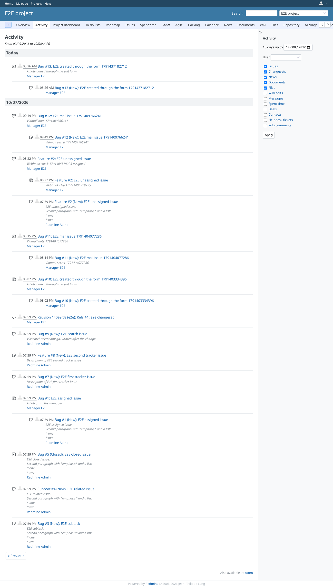
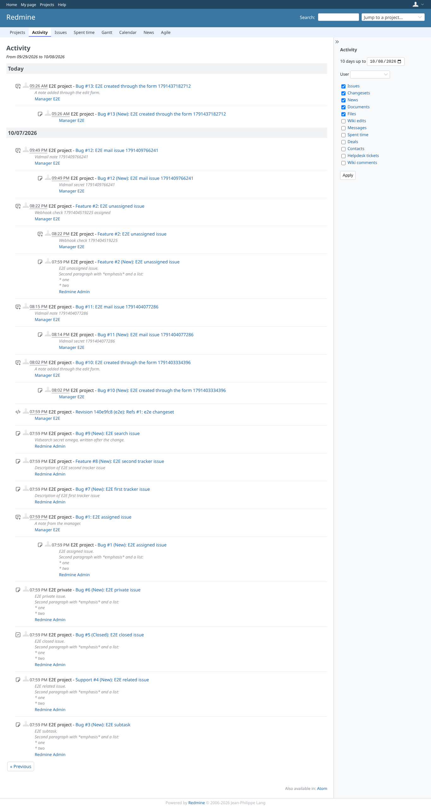
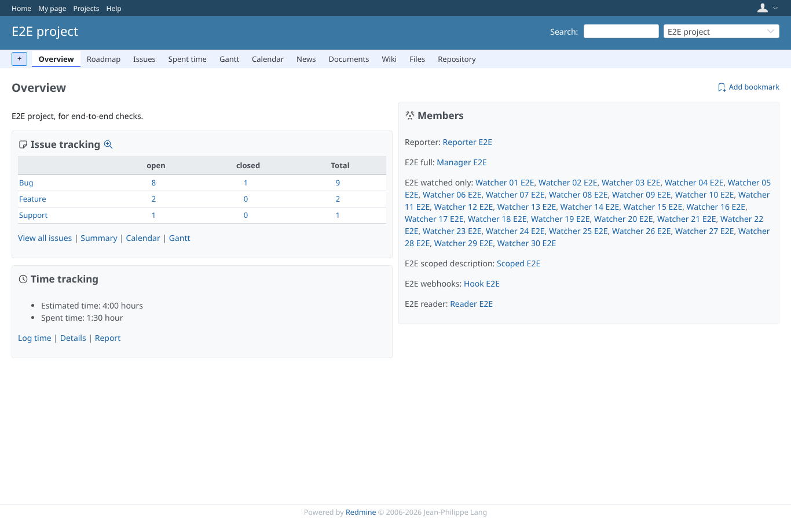

# activities

Run 2026-10-08T05:28:55.559Z against http://127.0.0.1:3001.

| screenshot | user | URL | shows |
|---|---|---|---|
|  | manager | `/projects/e2e-project/activity` | Manager (view_activities) has the Activity tab and opens it |
|  | manager | `/activity` | Manager (view_activities_global) opens the global activity |
|  | reporter | `/projects/e2e-project` | Reporter (no view_activities): no Activity tab in the project menu |
|  | reporter | `/projects/e2e-project/activity` | Reporter is refused the project activity (403) |
|  | reporter | `/activity` | Reporter is refused the global activity (403) |
|  | anonymous | `/login?back_url=http%3A%2F%2F127.0.0.1%3A3001%2Factivity` | Anonymous is sent to the login page for /activity |
