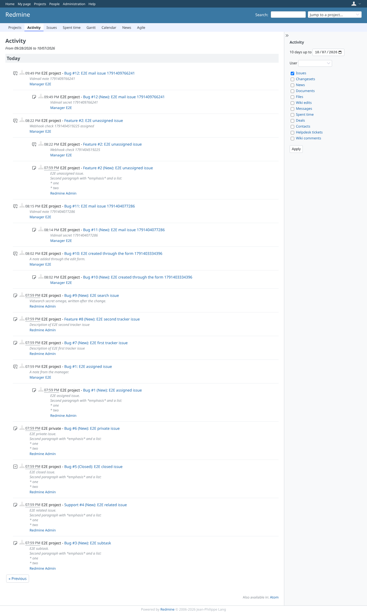
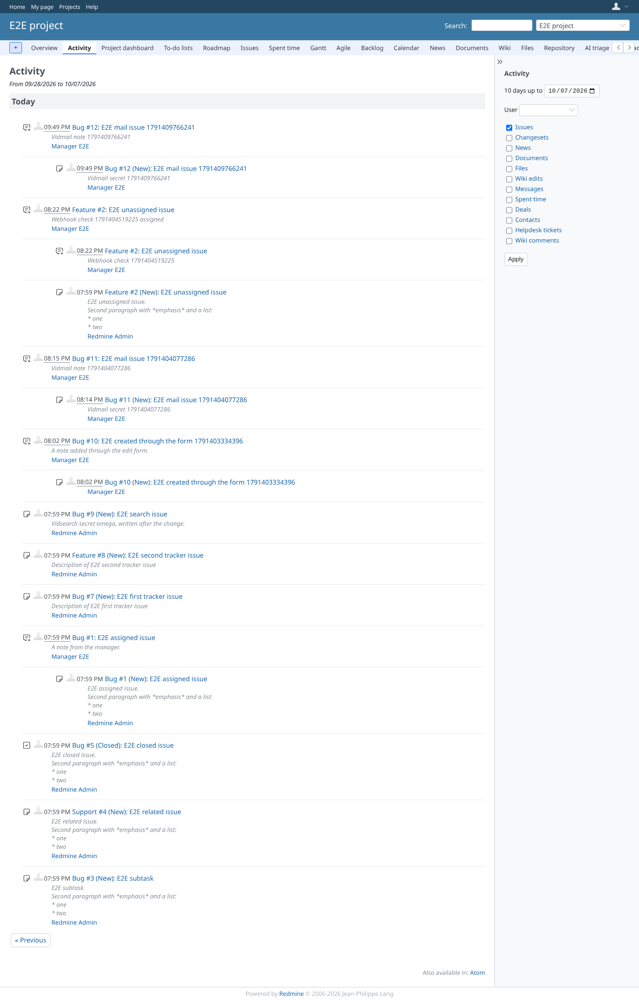
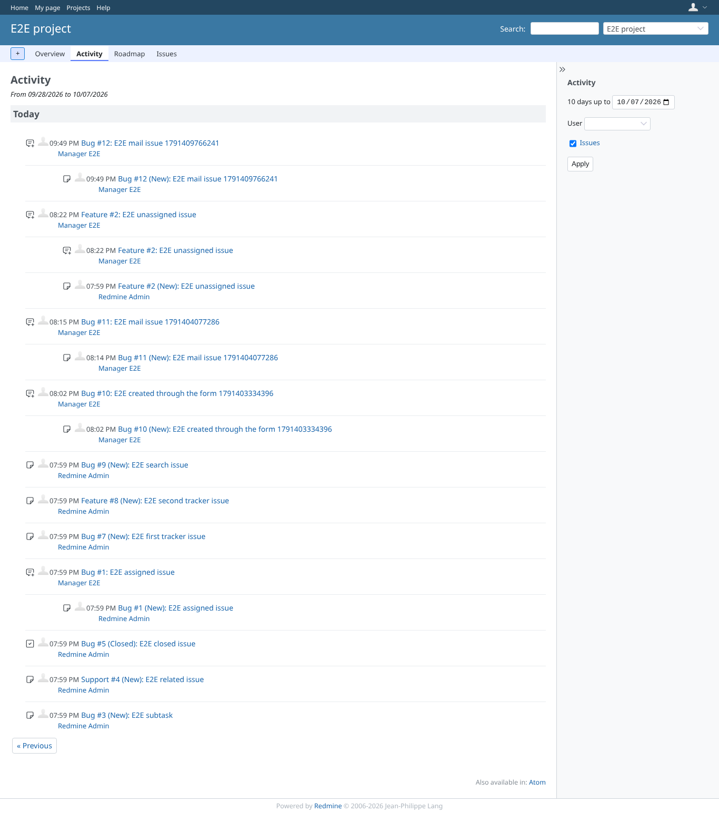
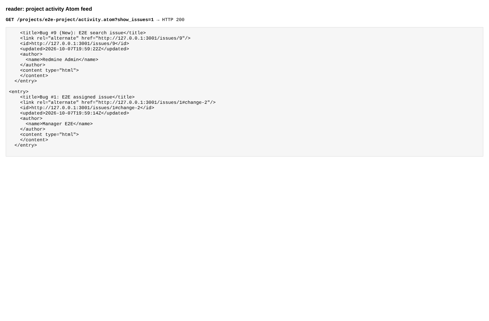
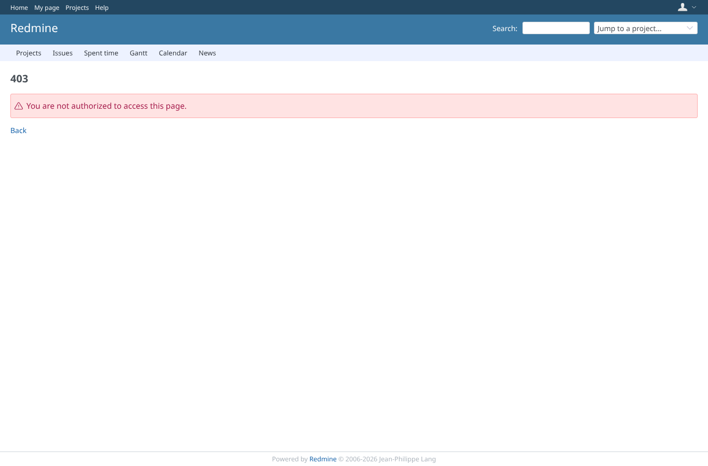

# activity_description

Run 2026-10-07T21:51:30.802Z against http://127.0.0.1:3001.

| screenshot | user | URL | shows |
|---|---|---|---|
|  | admin | `/activity?show_issues=1&from=2026-10-07` | Admin: the new issue in the global activity, with its description |
|  | manager | `/projects/e2e-project/activity?show_issues=1&from=2026-10-07` | Manager (view_issue_description): events with description and notes |
|  | reader | `/projects/e2e-project/activity?show_issues=1&from=2026-10-07` | reader (view_activities, no view_issue_description): the events stay, without description and notes |
|  | reader | `/projects/e2e-project/activity?show_issues=1&from=2026-10-07` | Atom feed: the entries of issues reader may not open have no description and no note |
|  | reporter | `/projects/e2e-project/activity` | Reporter has no view_activities: the activity tab stays refused (403), as before |
|  | outsider | `/projects/e2e-private/activity` | A non-member is refused the activity of the private project |
