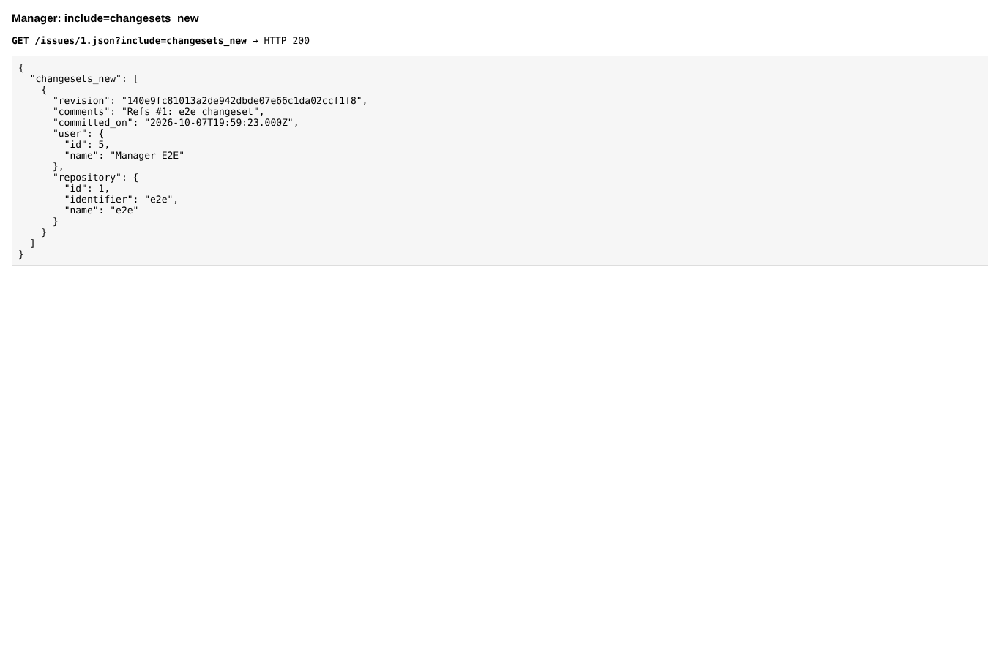
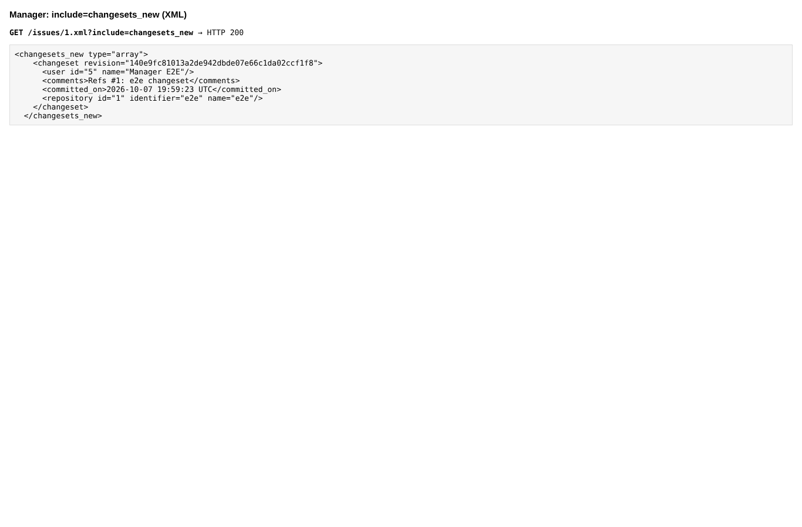
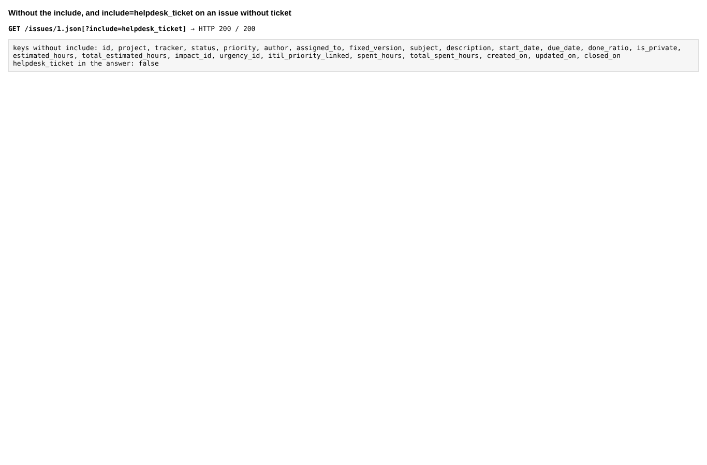

# api_includes

Run 2026-10-07T20:06:16.946Z against http://127.0.0.1:3001.

| screenshot | user | URL | shows |
|---|---|---|---|
|  | admin | `/my/page` | JSON: changesets_new carries revision, comments and the repository |
|  | admin | `/my/page` | XML: the same section |
|  | admin | `/my/page` | No extra sections without the include, none for an issue without helpdesk ticket |
