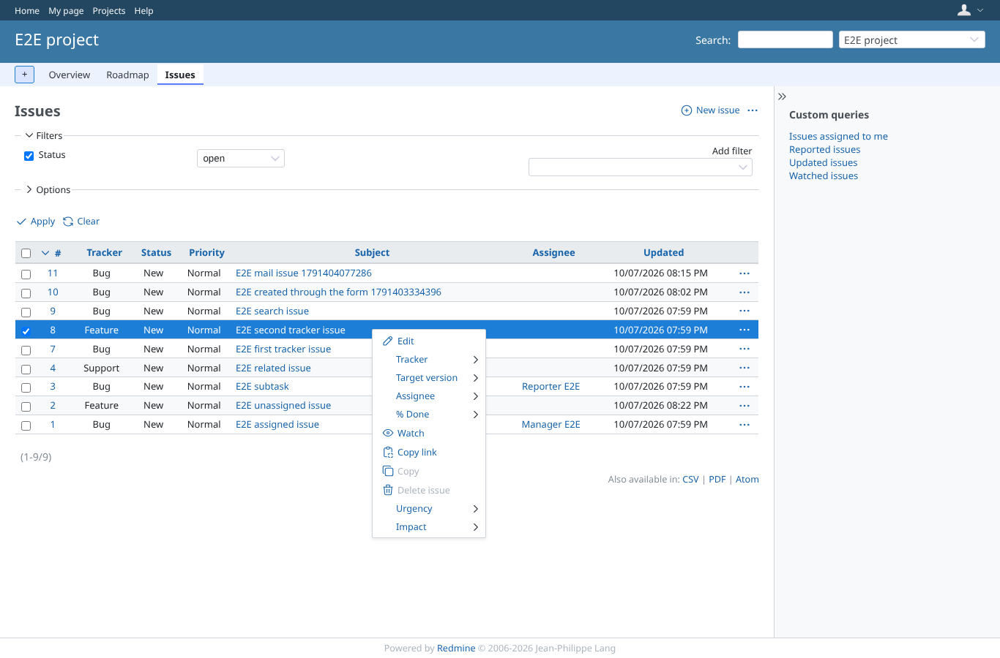
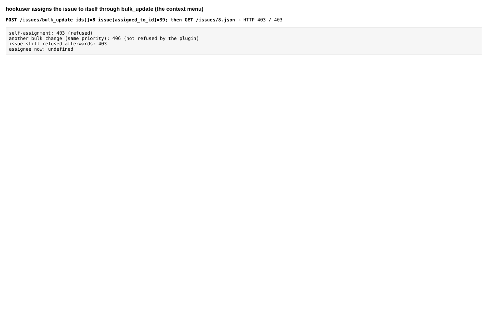
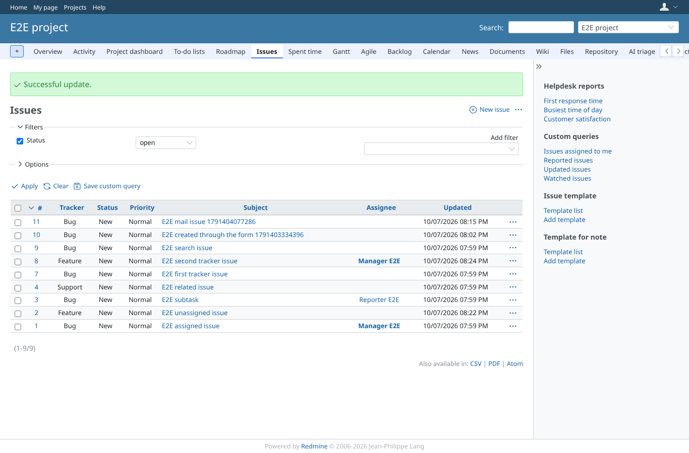
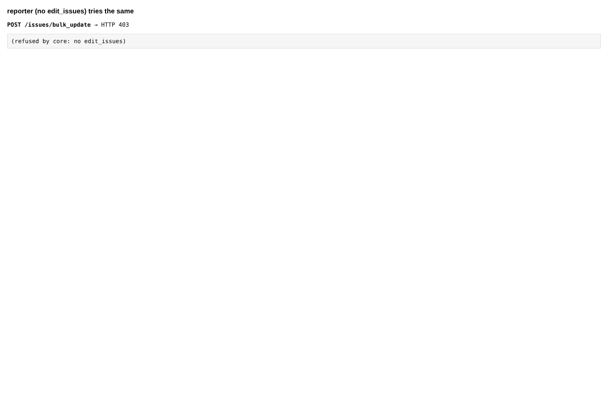

# bulk_assign

Run 2026-10-07T20:25:18.793Z against http://127.0.0.1:3001.

| screenshot | user | URL | shows |
|---|---|---|---|
|  | hookuser | `/projects/e2e-project/issues` | hookuser (edit_issues, no view_issue_description) opens the context menu of an issue it may not open |
|  | hookuser | `/projects/e2e-project/issues` | Self-assignment refused (403); the issue stays closed to hookuser |
|  | manager | `/projects/e2e-project/issues` | Manager (view_issue_description) assigns the issue to itself: allowed, as in core |
|  | reporter | `/projects/e2e-project/issues` | Reporter has no edit_issues: core refuses bulk edit (403) |
|  | outsider | `/projects/e2e-private/issues` | A non-member cannot reach the issues of the private project at all |
