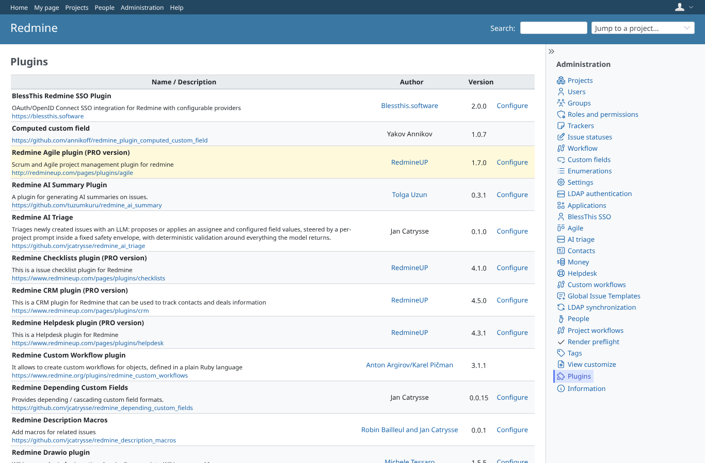
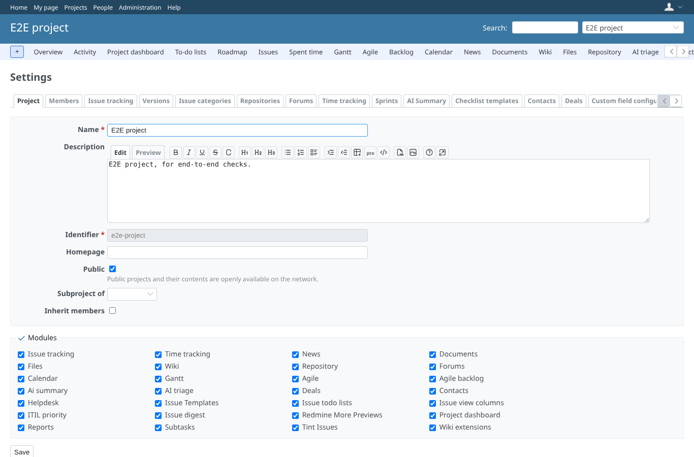
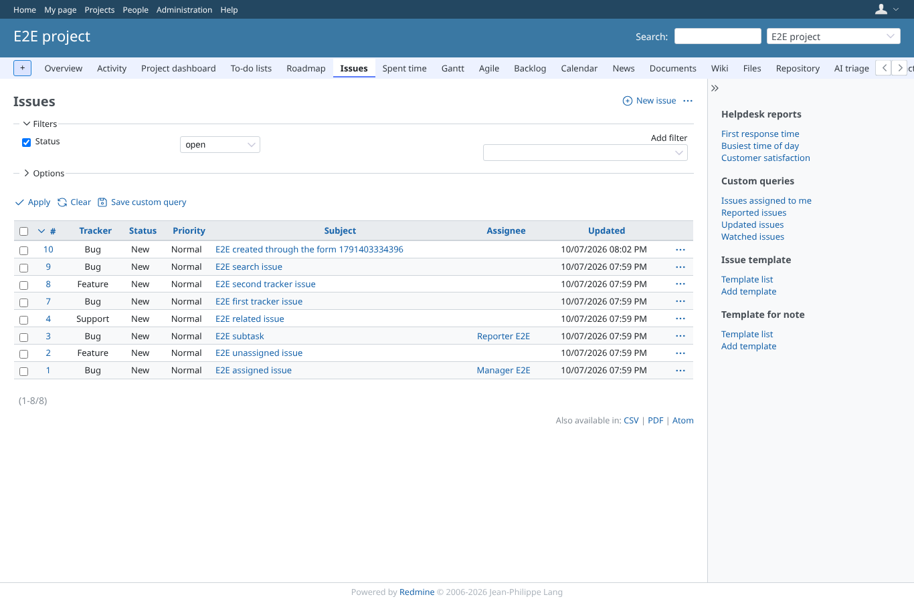
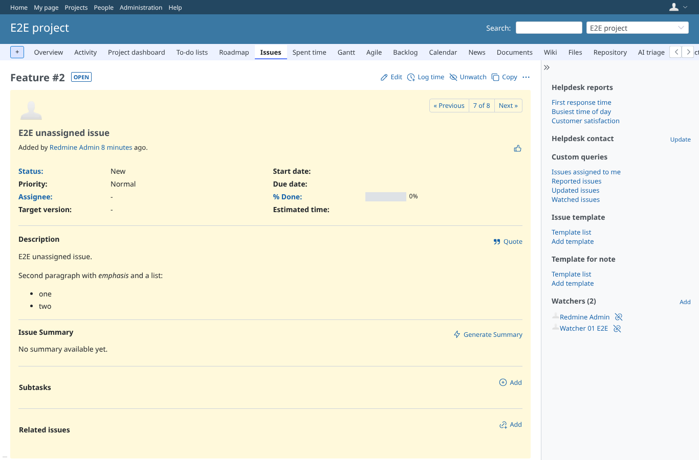
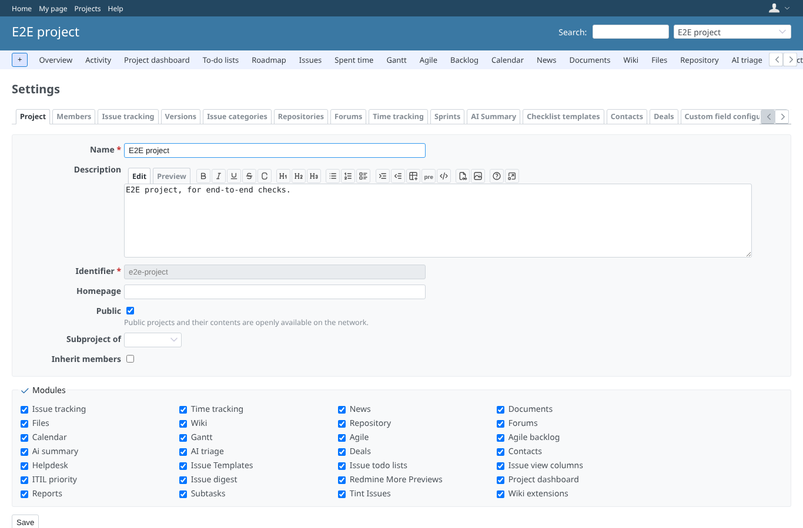
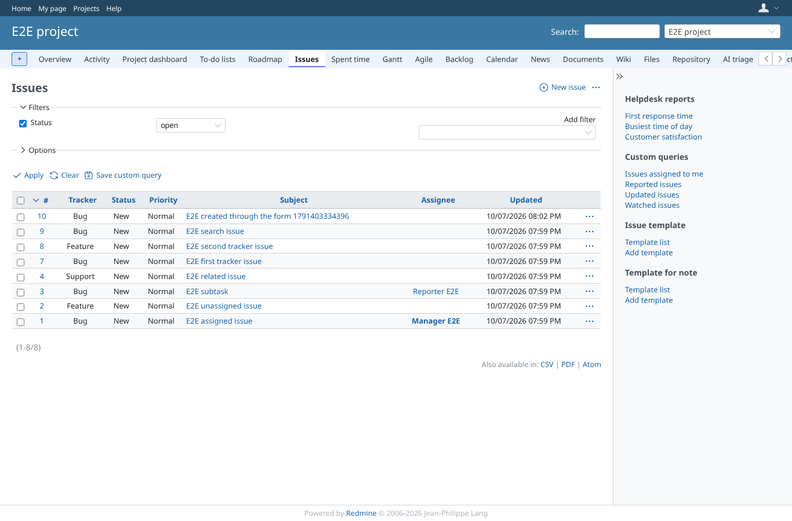
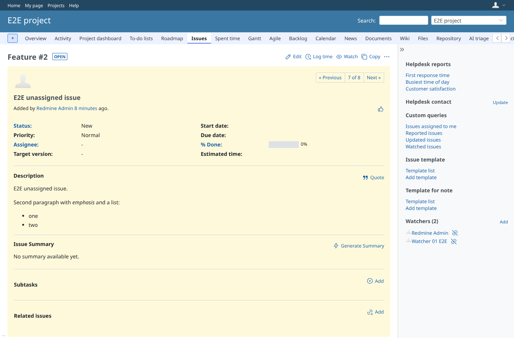
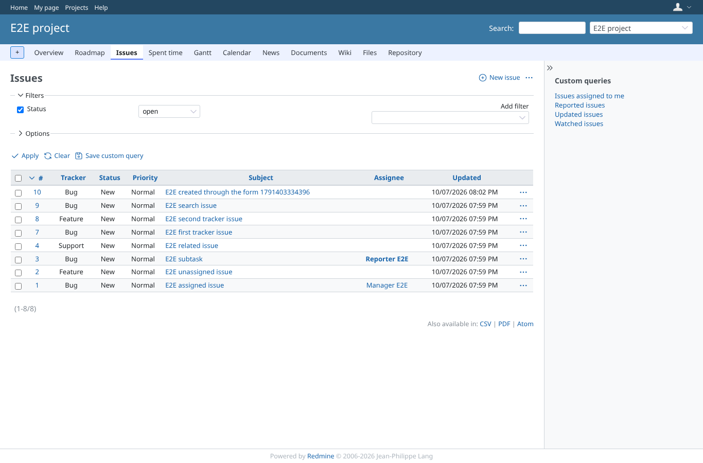

# core_pages

Run 2026-10-07T20:08:28.800Z against http://127.0.0.1:3001.

| screenshot | user | URL | shows |
|---|---|---|---|
|  | admin | `/admin/plugins` | Administration > Plugins: the plugins installed for this run (HTTP 200) |
|  | admin | `/projects/e2e-project/settings` | admin: Project > Settings answers 200 |
|  | admin | `/projects/e2e-project/issues` | admin: the issue list answers 200 |
|  | admin | `/issues/2` | admin: an issue page answers 200 |
|  | manager | `/projects/e2e-project/settings` | manager: Project > Settings answers 200 |
|  | manager | `/projects/e2e-project/issues` | manager: the issue list answers 200 |
|  | manager | `/issues/2` | manager: an issue page answers 200 |
|  | reporter | `/projects/e2e-project/issues` | reporter: the issue list answers 200 (settings 403: no manage_project) |
|  | reporter | `/issues/2` | reporter: the issue page stays refused by this plugin (403), not a 500 |
|  | outsider | `/issues/6` | outsider: an issue of the private project is refused (403) |
