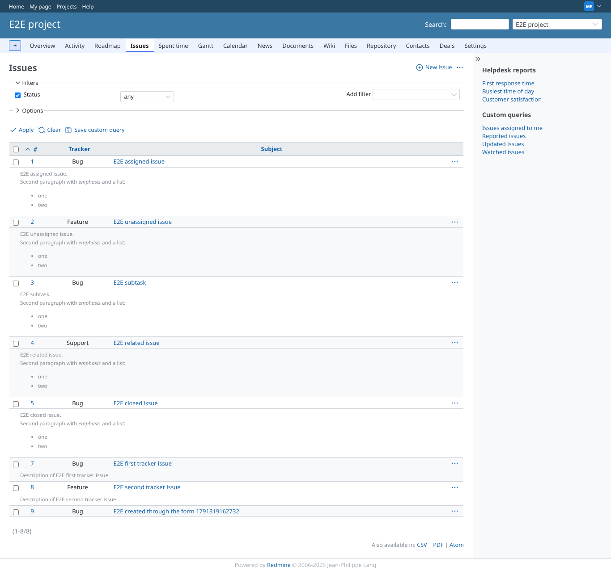
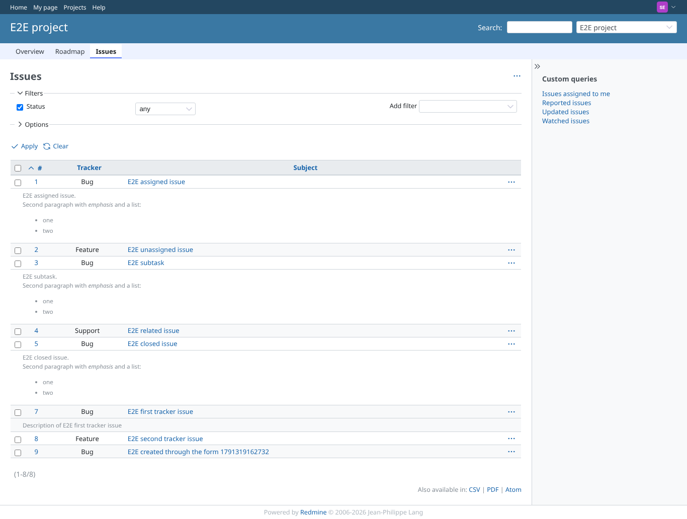
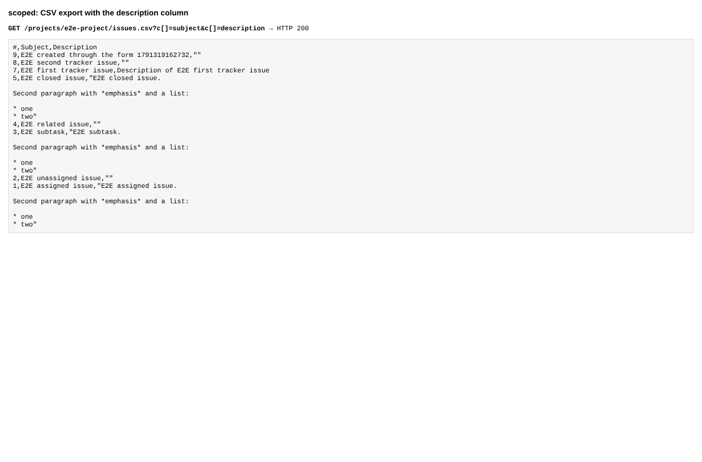
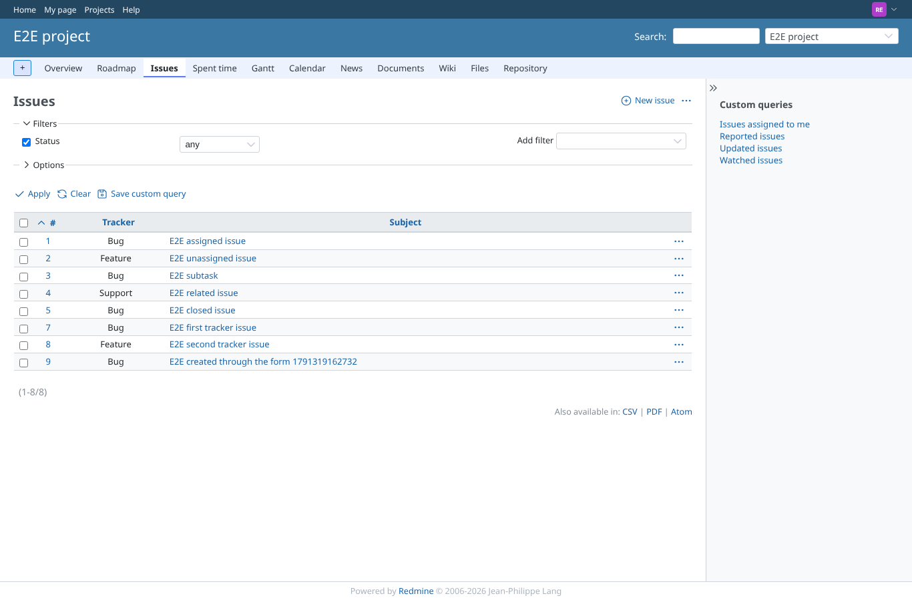
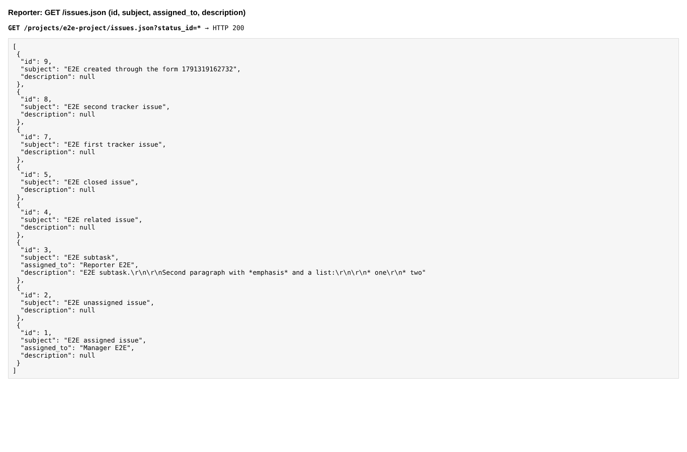

# description_lists

Run 2026-10-06T20:40:24.440Z against http://127.0.0.1:3000.

| screenshot | user | URL | shows |
|---|---|---|---|
|  | manager | `/projects/e2e-project/issues?set_filter=1&status_id=*&c[]=tracker&c[]=subject&c[]=description&sort=id` | Manager: the description column shows every description |
|  | scoped | `/projects/e2e-project/issues?set_filter=1&status_id=*&c[]=tracker&c[]=subject&c[]=description&sort=id` | scoped (view_issue_description for Bug only): the Bug description is shown, the Feature one is empty |
|  | scoped | `/projects/e2e-project/issues?set_filter=1&status_id=*&c[]=tracker&c[]=subject&c[]=description&sort=id` | CSV export: the Feature issue has an empty description |
|  | reporter | `/projects/e2e-project/issues?set_filter=1&status_id=*&c[]=tracker&c[]=subject&c[]=description&sort=id` | Reporter (no view_issue_description): no description column even when asked for in the URL |
|  | reporter | `/projects/e2e-project/issues?set_filter=1&status_id=*&c[]=tracker&c[]=subject&c[]=description&sort=id` | API index: description null except for the subtask the reporter is assigned to |
