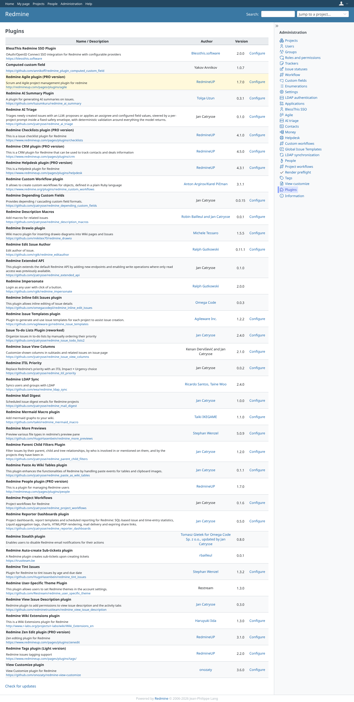
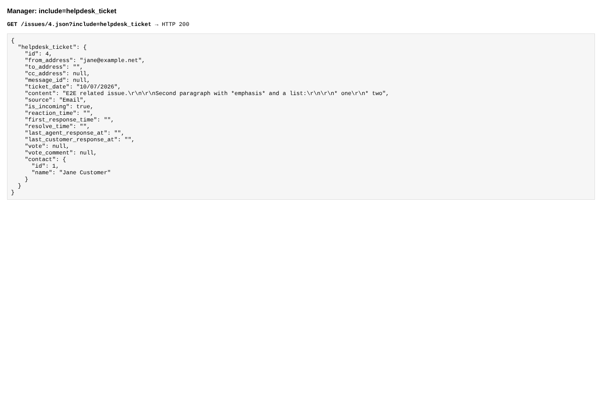
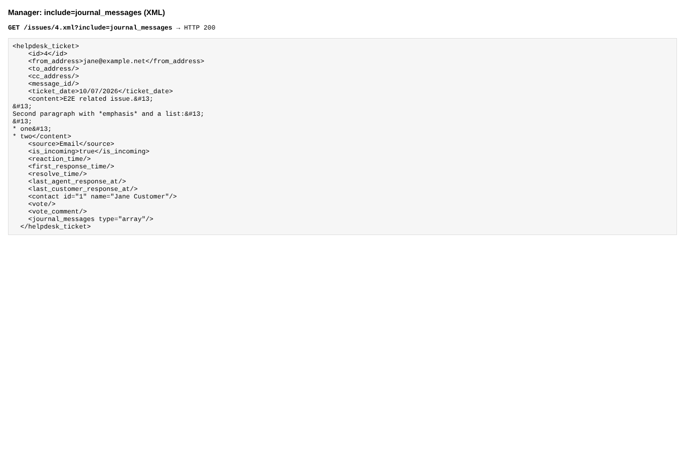

# helpdesk_api

Run 2026-10-07T20:10:12.418Z against http://127.0.0.1:3001.

| screenshot | user | URL | shows |
|---|---|---|---|
|  | admin | `/admin/plugins` | redmine_contacts and redmine_contacts_helpdesk are installed next to this plugin |
|  | admin | `/admin/plugins` | JSON: the helpdesk_ticket section with its contact (the 4.3 #contact) |
|  | admin | `/admin/plugins` | XML: helpdesk_ticket with contact and journal_messages |
