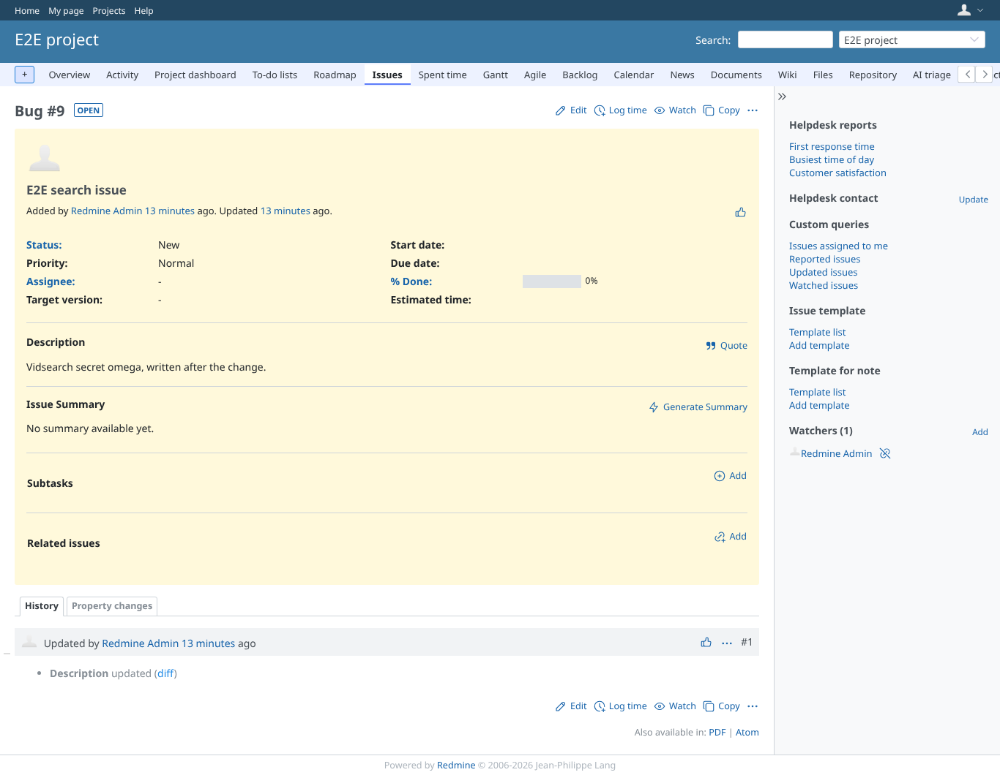
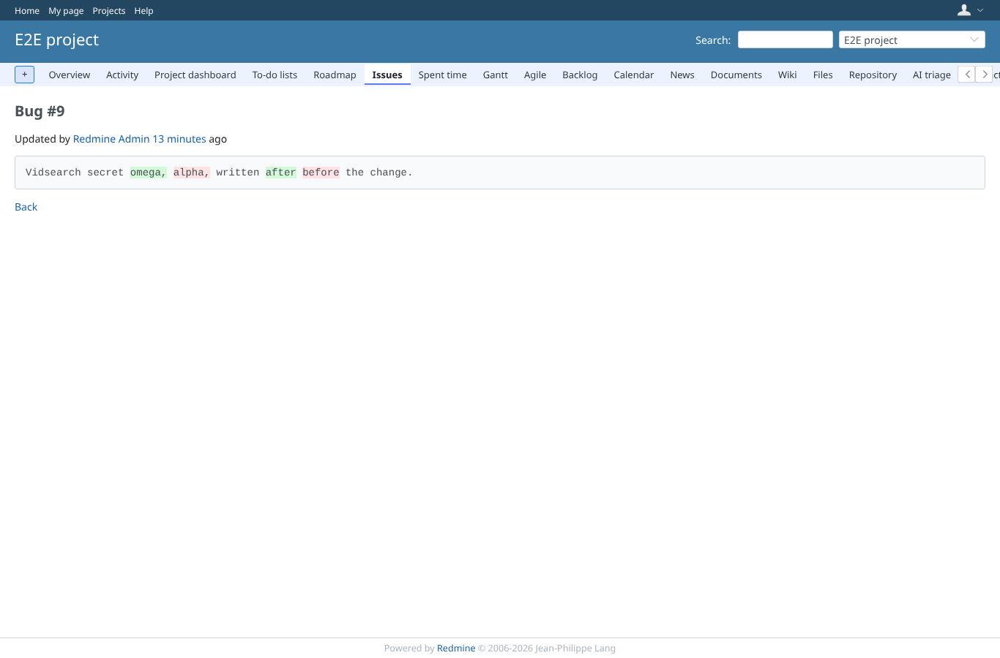
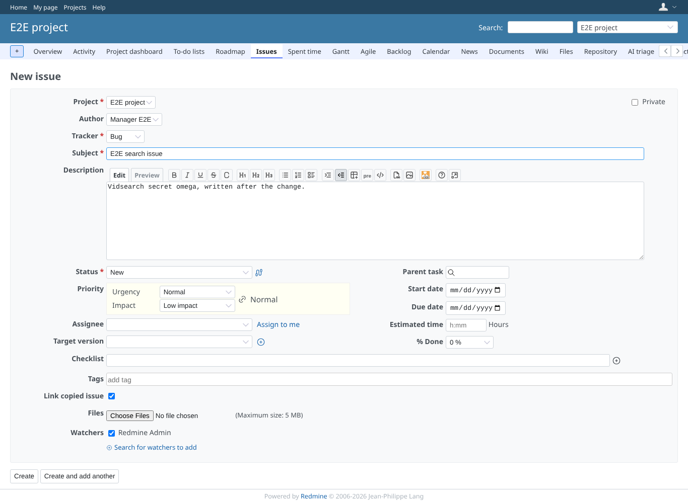
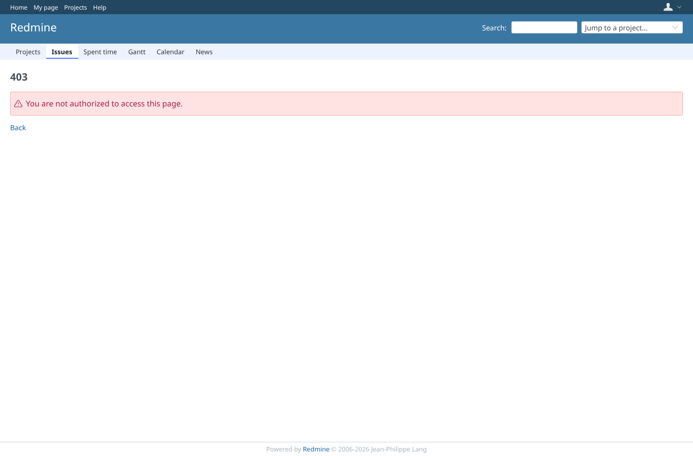
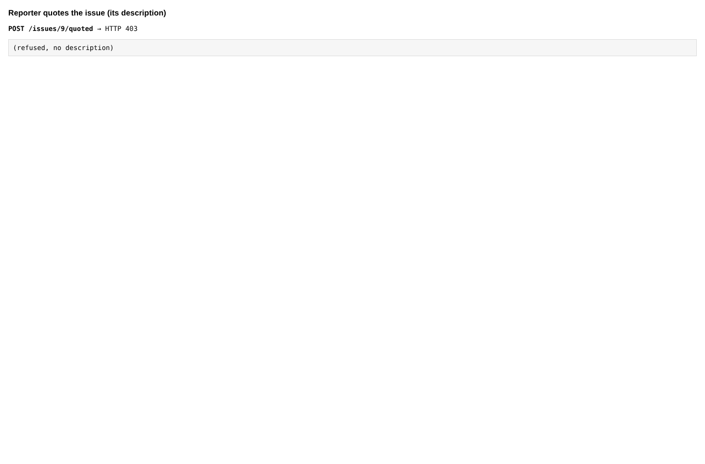
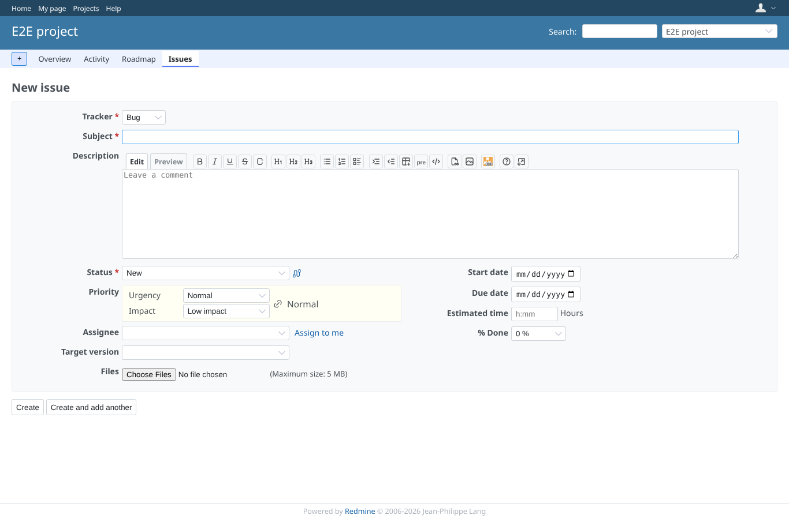

# journal_description

Run 2026-10-07T20:14:36.787Z against http://127.0.0.1:3001.

| screenshot | user | URL | shows |
|---|---|---|---|
|  | admin | `/journals/3/diff` | Admin sees the description diff |
|  | manager | `/issues/9` | Manager (view_issue_description): the history links to the description diff |
|  | manager | `/journals/3/diff` | Manager sees the old and the new description |
|  | manager | `/projects/e2e-project/issues/9/copy` | Manager copies the issue: the form carries the description |
|  | reporter | `/journals/3/diff` | Reporter (view_issues, no view_issue_description) is refused the description diff |
|  | reporter | `/projects/e2e-project/issues` | Quoting the issue description is refused (403) |
|  | reader | `/projects/e2e-project/issues/9/copy` | reader (add_issues + copy_issues, no view_issue_description) is refused the copy form |
|  | reader | `/projects/e2e-project/issues/new` | A new issue without a source stays open to reader |
|  | reader | `/journals/3/diff` | reader is refused the description diff as well |
|  | outsider | `/journals/3/diff` | A non-member of the public project is refused the description diff (core alone would show it) |
|  | outsider | `/projects/e2e-private/issues/6/copy` | A non-member is refused copying an issue of the private project |
