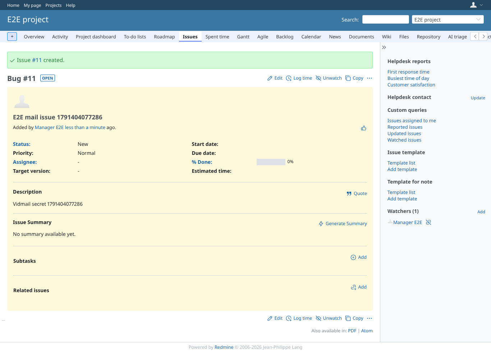
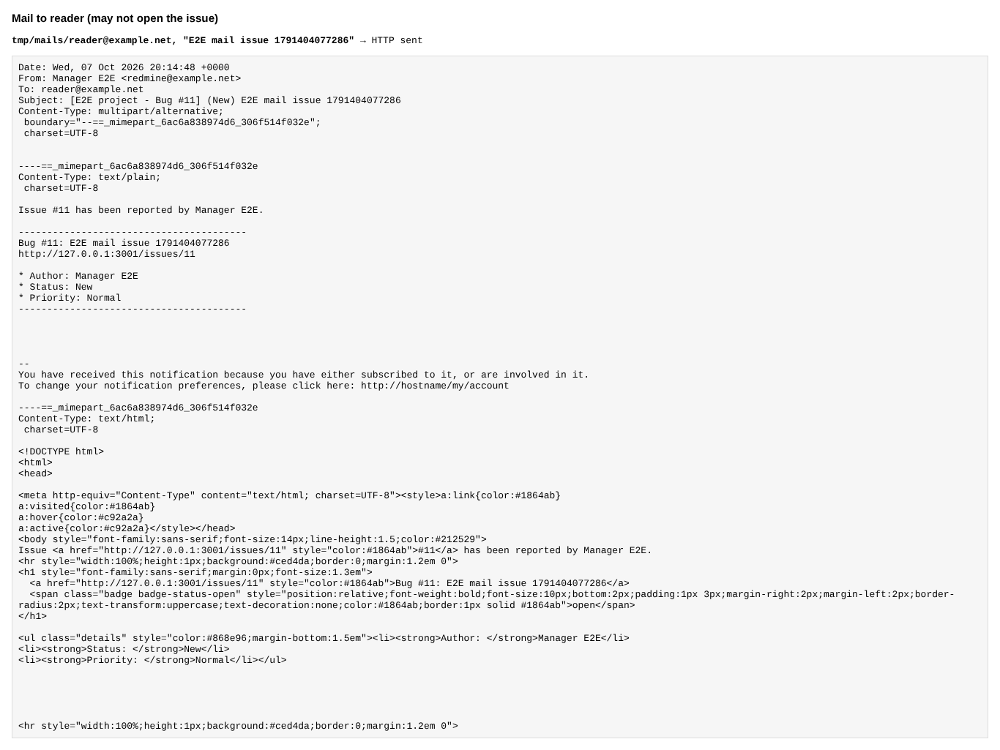
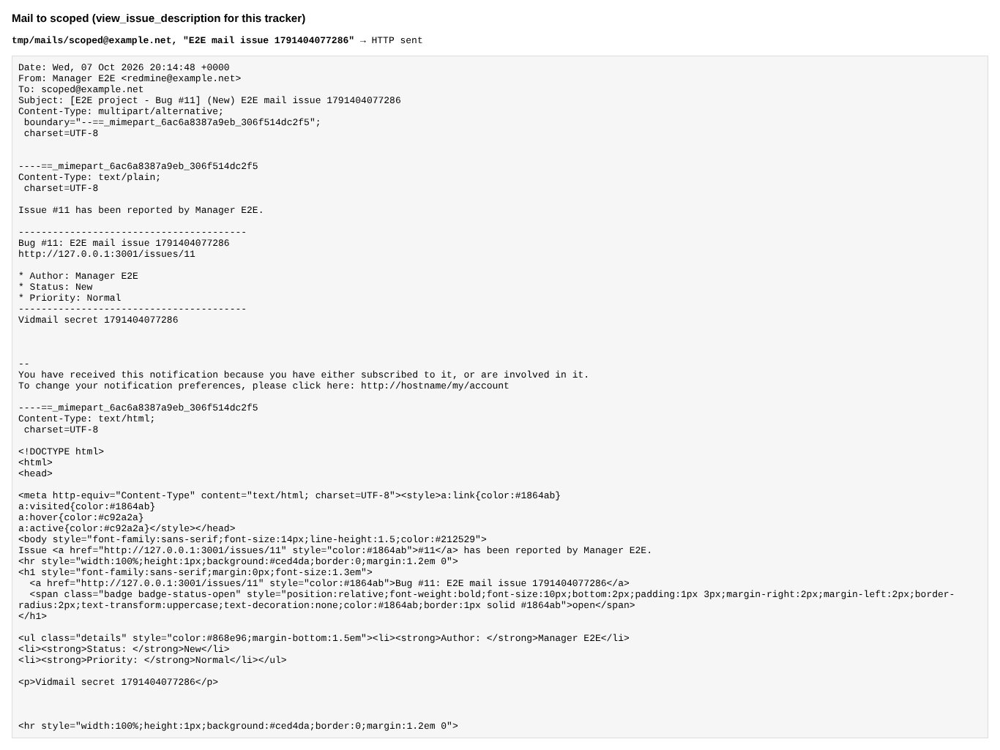
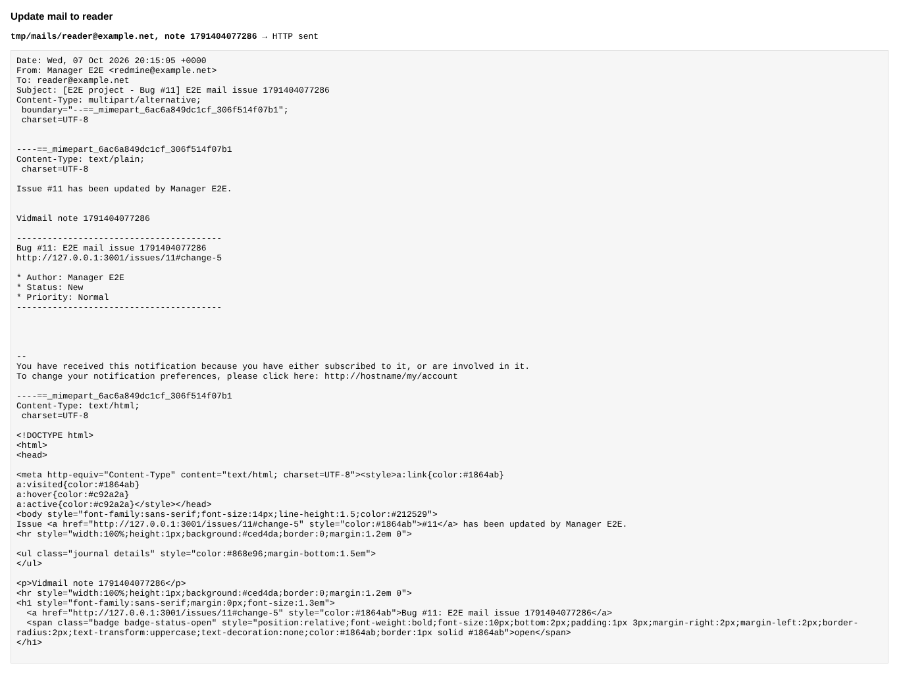

# mail_description

Run 2026-10-07T20:15:11.868Z against http://127.0.0.1:3001.

| screenshot | user | URL | shows |
|---|---|---|---|
|  | manager | `/issues/11` | Manager creates an issue (first tracker) with a description |
|  | manager | `/issues/11` | reader still gets the mail of the new issue, without the description |
|  | manager | `/issues/11` | scoped (may open the issue) gets the mail with the description |
|  | manager | `/issues/11` | The update mail to reader has the note, not the description |
