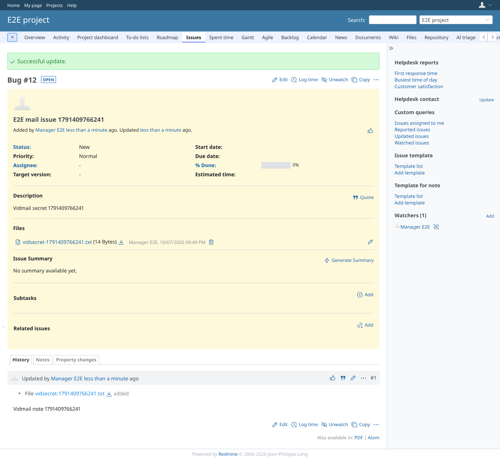
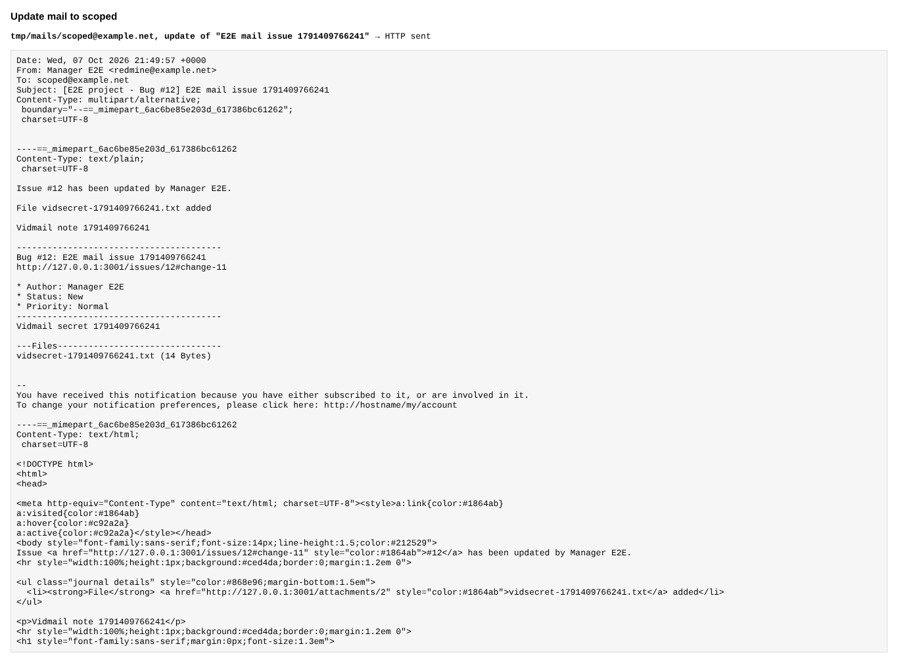

# mail_description

Run 2026-10-07T21:50:09.624Z against http://127.0.0.1:3001.

| screenshot | user | URL | shows |
|---|---|---|---|
|  | manager | `/issues/12` | Manager creates an issue (first tracker) with a description |
|  | manager | `/issues/12` | reader still gets the mail of the new issue, without the description |
|  | manager | `/issues/12` | scoped (may open the issue) gets the mail with the description |
|  | manager | `/issues/12` | Manager adds a note and an attachment to the issue |
|  | manager | `/issues/12` | The update mail still reaches reader, without note, attachment name or description |
|  | manager | `/issues/12` | scoped (may open the issue) gets the note and the attachment name |
