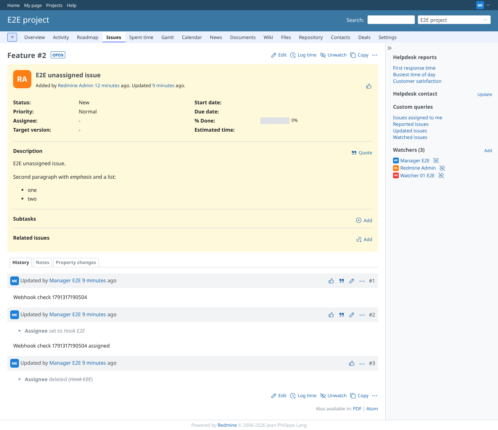
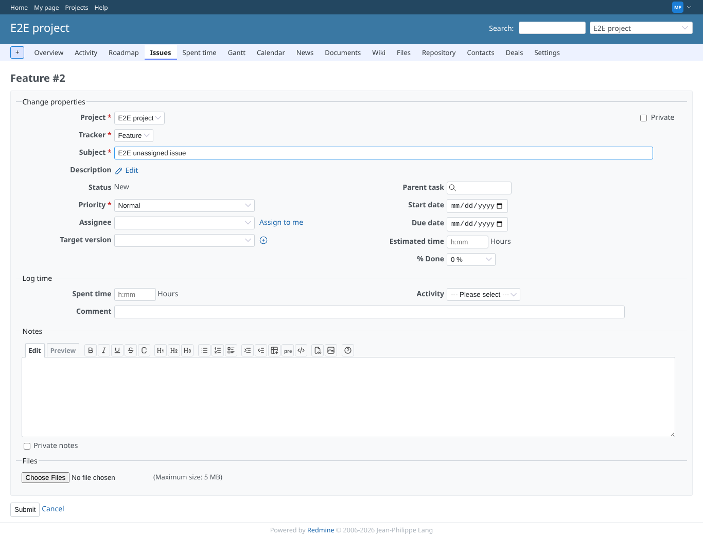
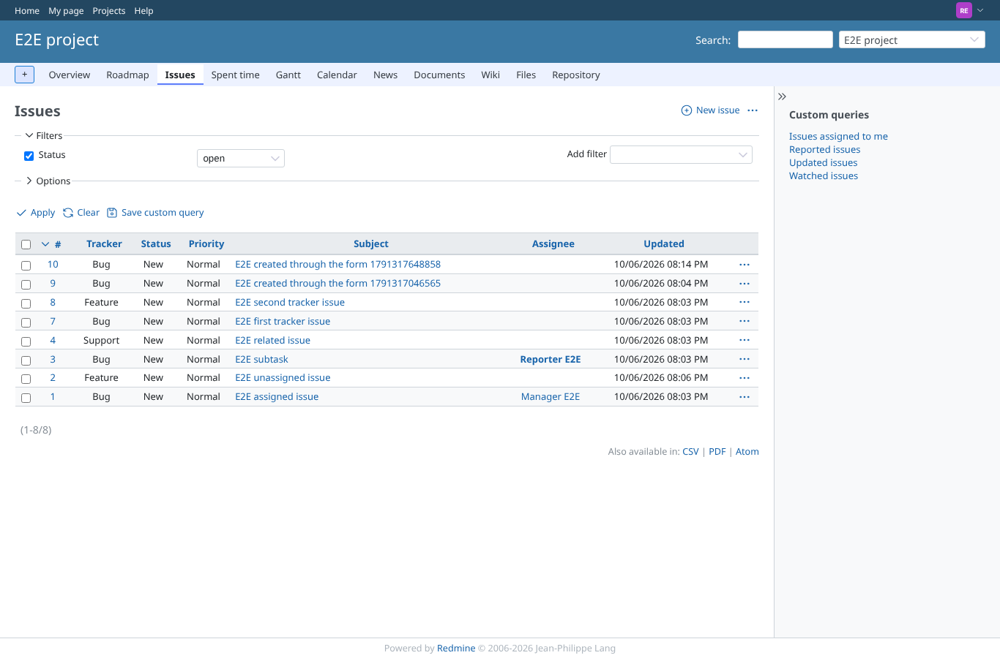
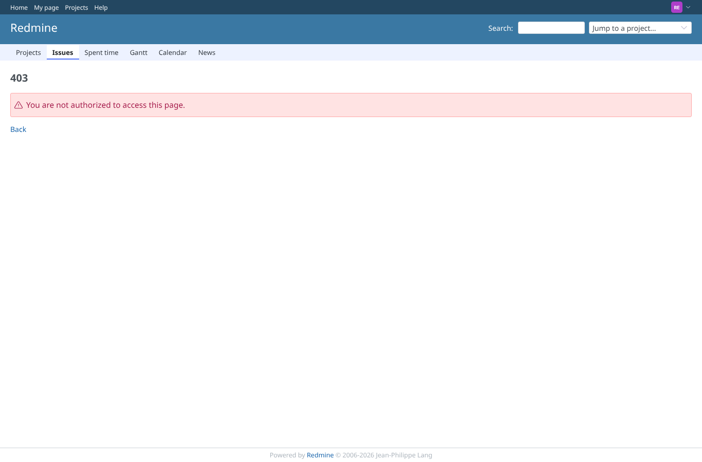
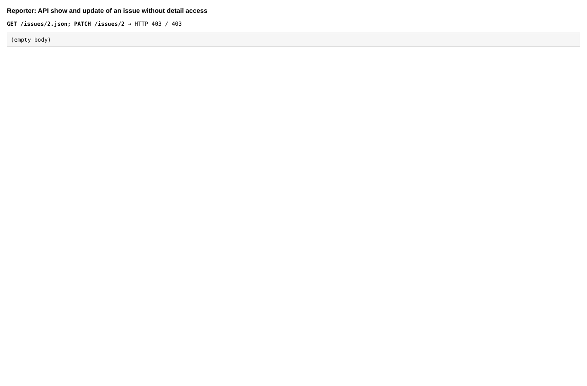
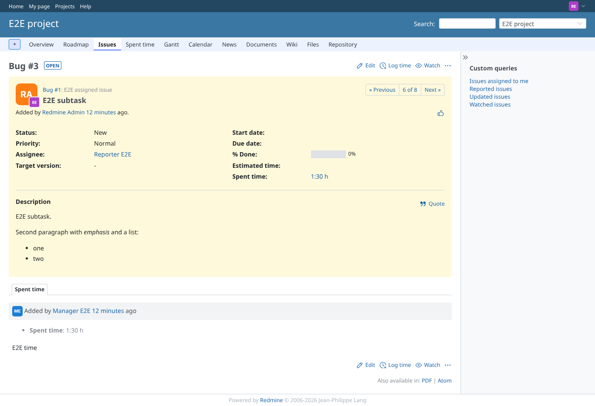
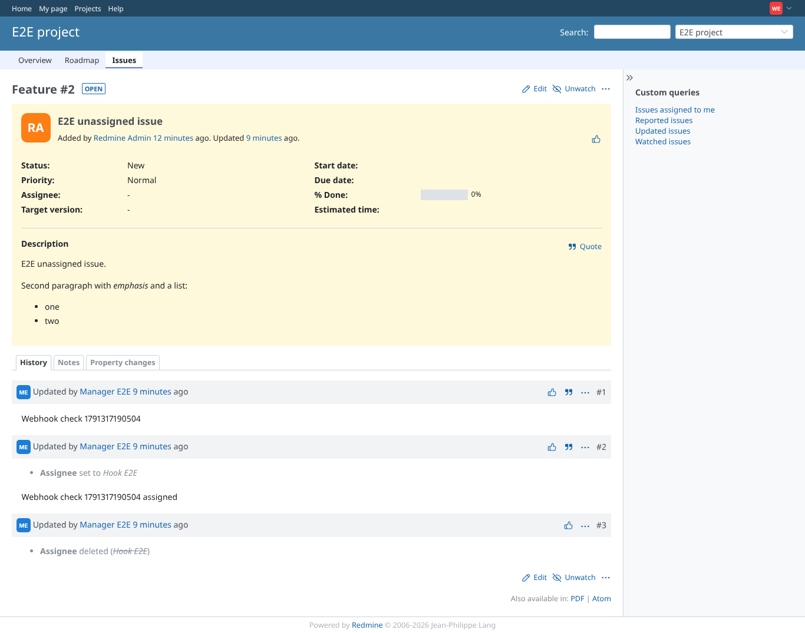
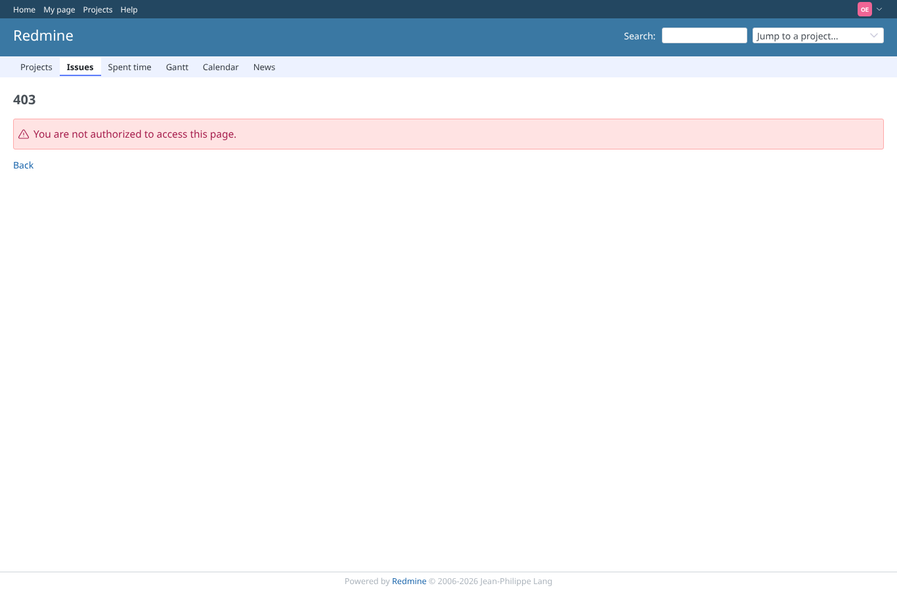

# issue_access

Run 2026-10-06T20:15:31.551Z against http://127.0.0.1:3000.

| screenshot | user | URL | shows |
|---|---|---|---|
|  | manager | `/issues/2` | Manager (view_issue_description) opens the issue and sees the description |
|  | manager | `/issues/2/edit` | Manager can open the edit form |
|  | reporter | `/projects/e2e-project/issues` | Reporter (no plugin permission) still sees the issue in the list |
|  | reporter | `/issues/2` | Reporter is refused the issue page (403) |
|  | reporter | `/issues/2/edit` | Reporter is refused the edit form (403) |
|  | reporter | `/projects/e2e-project/issues` | API show and an update from the page are refused (403) as well |
|  | reporter | `/issues/3?tab=time_entries` | Reporter opens the subtask it is assigned to (assignee path) |
|  | watcher01 | `/issues/2` | watcher01 (view_watched_issues, no view_issue_description) opens the issue it watches |
|  | watcher01 | `/issues/1` | watcher01 is refused an issue it does not watch |
|  | outsider | `/issues/6` | A non-member is refused an issue of the private project |
