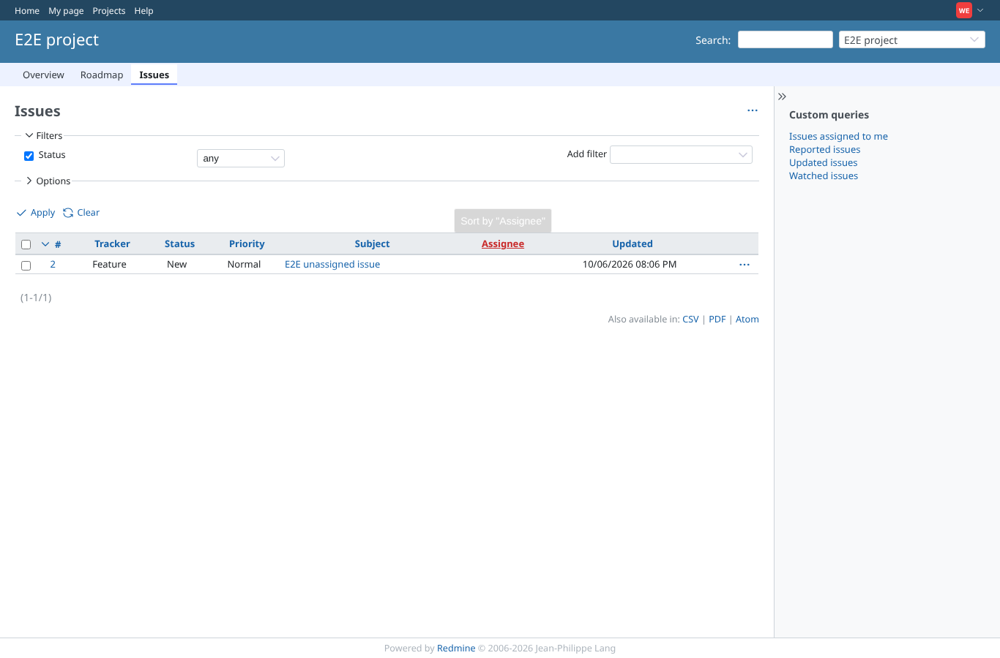
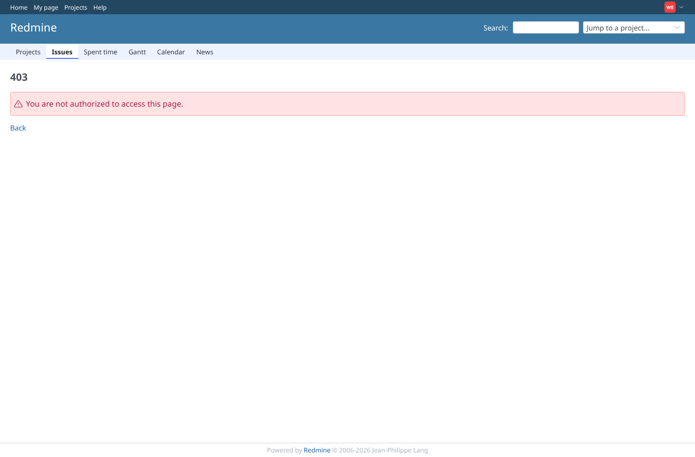
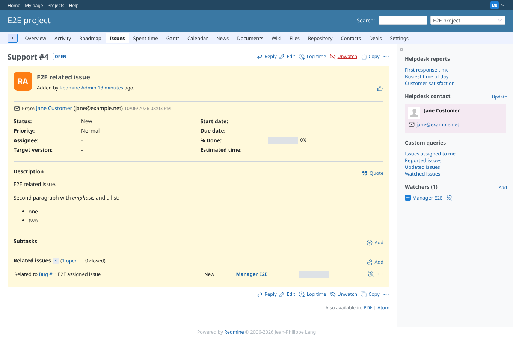

# watched_issues

Run 2026-10-06T20:15:49.169Z against http://127.0.0.1:3000.

| screenshot | user | URL | shows |
|---|---|---|---|
|  | watcher01 | `/projects/e2e-project/issues?set_filter=1&status_id=*` | watcher01 ("own issues" visibility) lists exactly the issue it watches |
|  | watcher01 | `/issues/4` | Watching #4 itself is refused (403), so the issue stays closed to watcher01 |
|  | manager | `/issues/4` | Manager can watch an issue (the link turns into Unwatch) |
