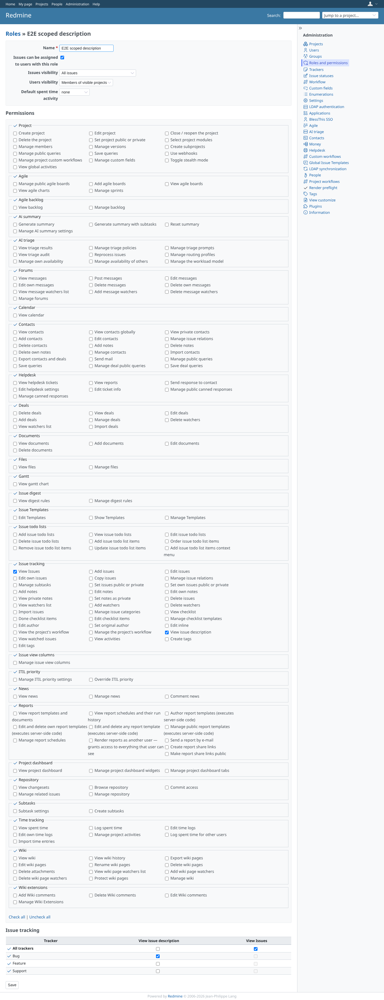
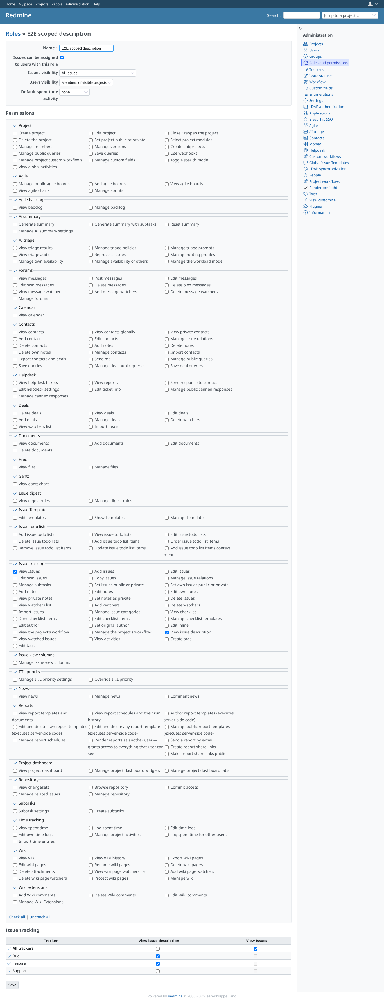
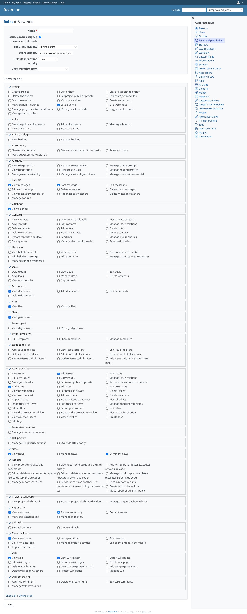

# role_form

Run 2026-10-08T05:41:29.463Z against http://127.0.0.1:3001.

| screenshot | user | URL | shows |
|---|---|---|---|
|  | admin | `/roles/8/edit` | The tracker table has the plugin columns; the scoped role has view_issue_description for the first tracker only |
|  | admin | `/roles/8/edit` | After saving, view_issue_description is granted for two trackers |
|  | admin | `/roles/new` | A role without view_issues hides the tracker table, plugin columns included |
