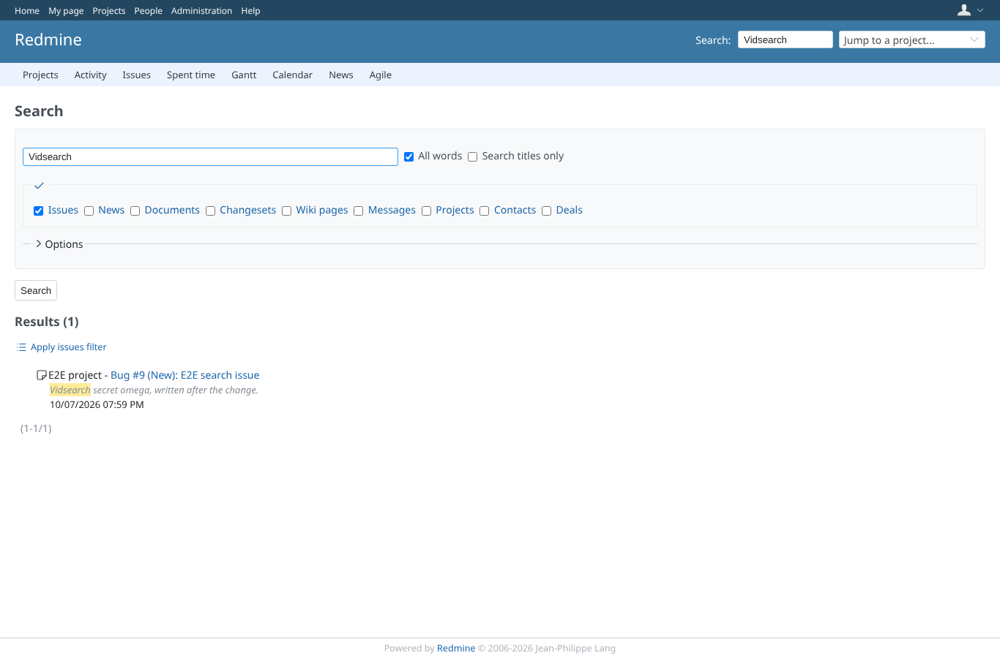
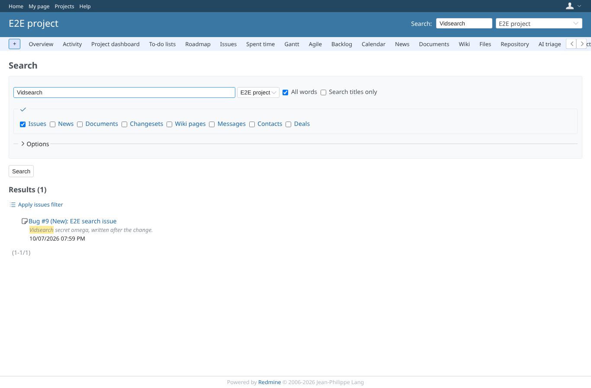
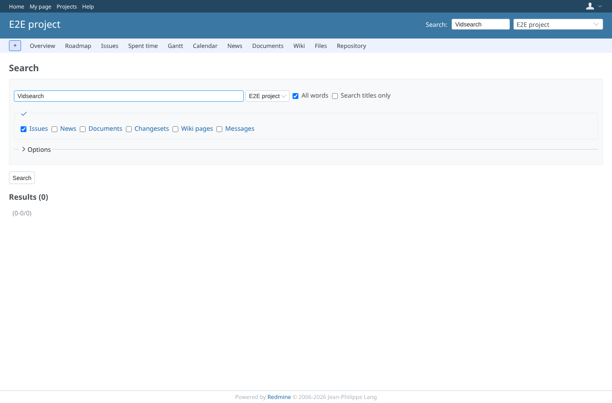
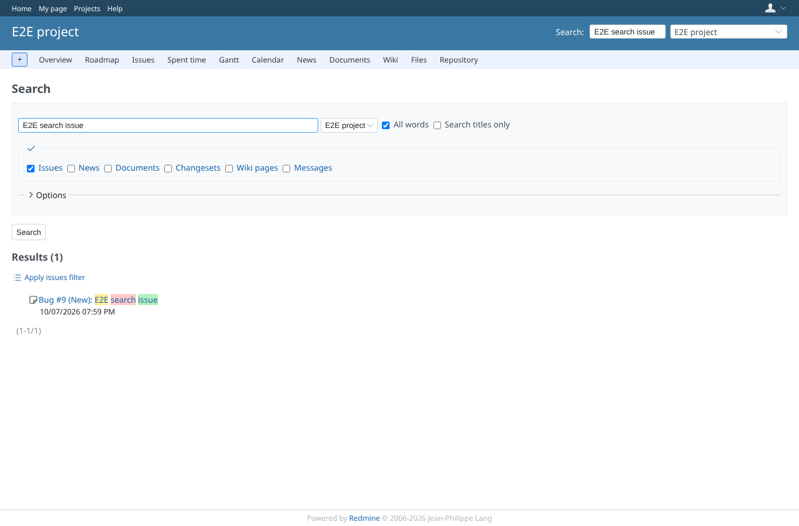
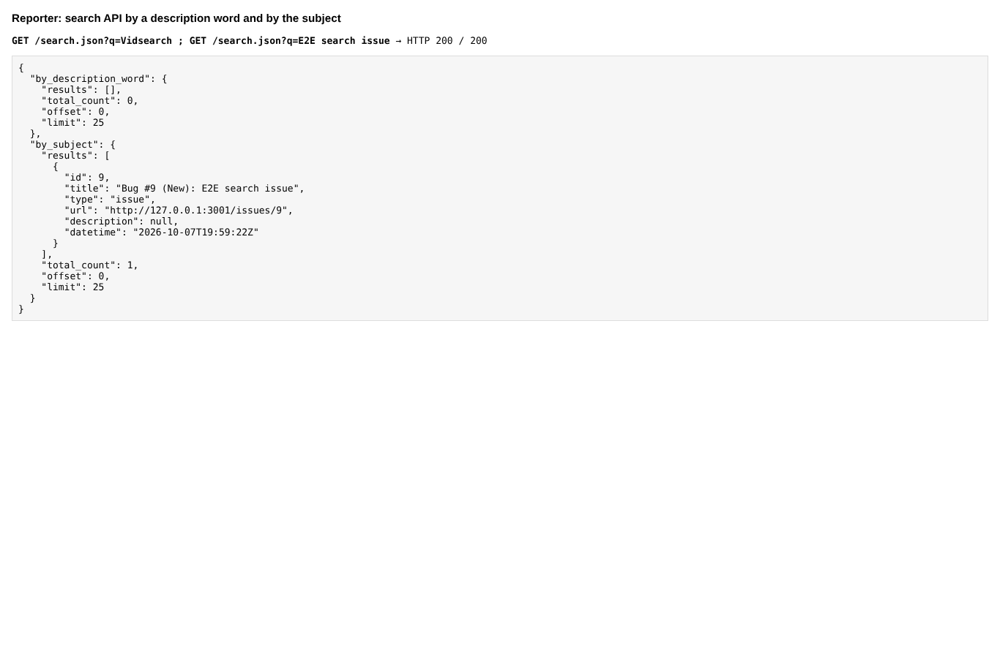
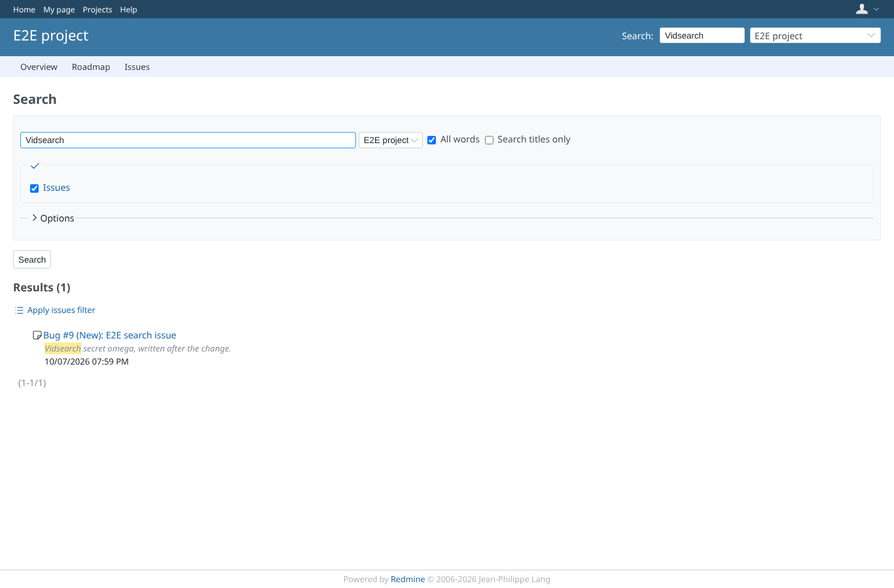
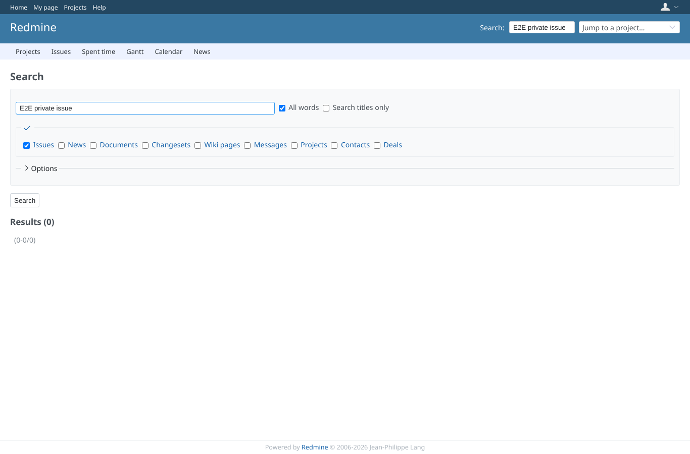

# search

Run 2026-10-07T20:17:35.672Z against http://127.0.0.1:3001.

| screenshot | user | URL | shows |
|---|---|---|---|
|  | admin | `/search?q=Vidsearch&issues=1` | Admin finds the issue by a word of its description, description shown |
|  | manager | `/projects/e2e-project/search?q=Vidsearch&issues=1` | Manager (view_issue_description) finds it by its description and sees it |
|  | reporter | `/projects/e2e-project/search?q=Vidsearch&issues=1` | Reporter (no view_issue_description): a word of the description finds nothing |
|  | reporter | `/projects/e2e-project/search?q=E2E%20search%20issue&issues=1` | Reporter still finds the issue by its subject, without the description |
|  | reporter | `/projects/e2e-project/search?q=E2E%20search%20issue&issues=1` | search.json: no hit by the description word; by subject the hit has an empty description |
|  | scoped | `/projects/e2e-project/search?q=Vidsearch&issues=1` | scoped (view_issue_description for the first tracker) finds the first-tracker issue by its description |
|  | outsider | `/search?q=E2E%20private%20issue&issues=1` | A non-member does not find the issue of the private project |
