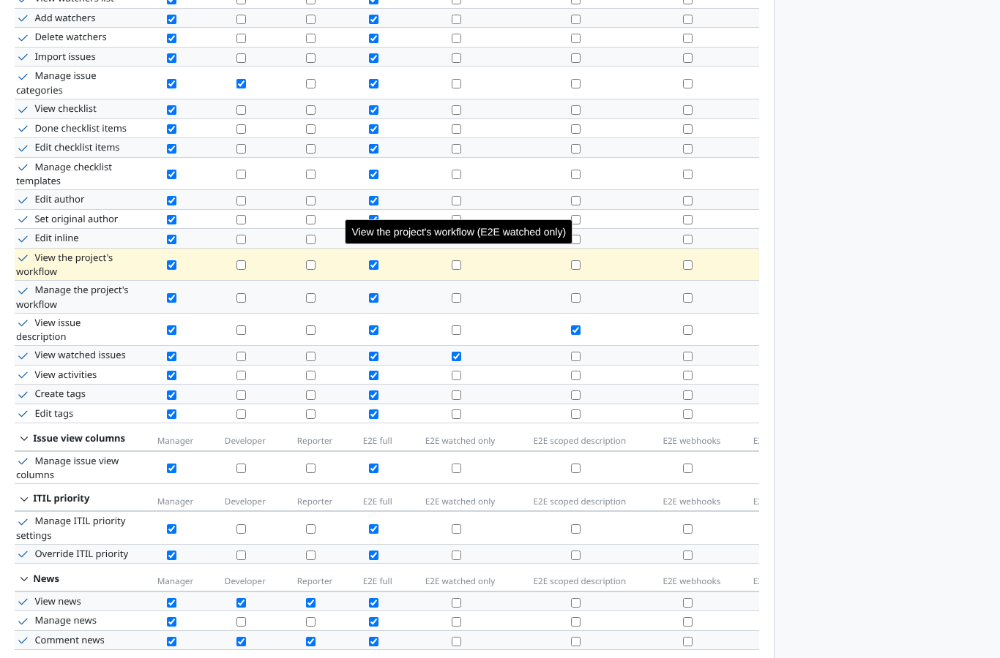
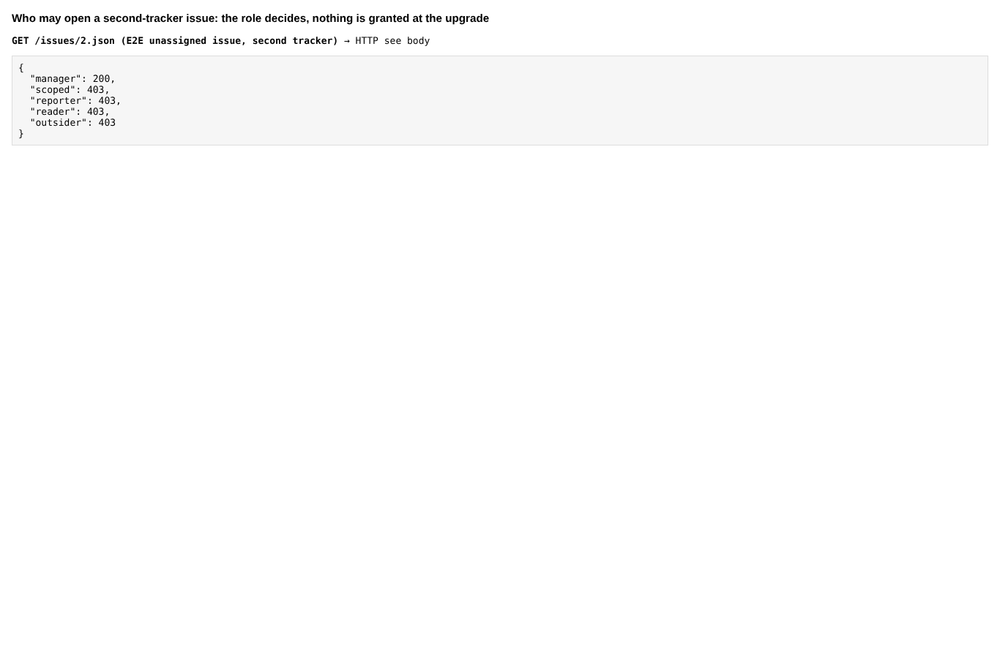
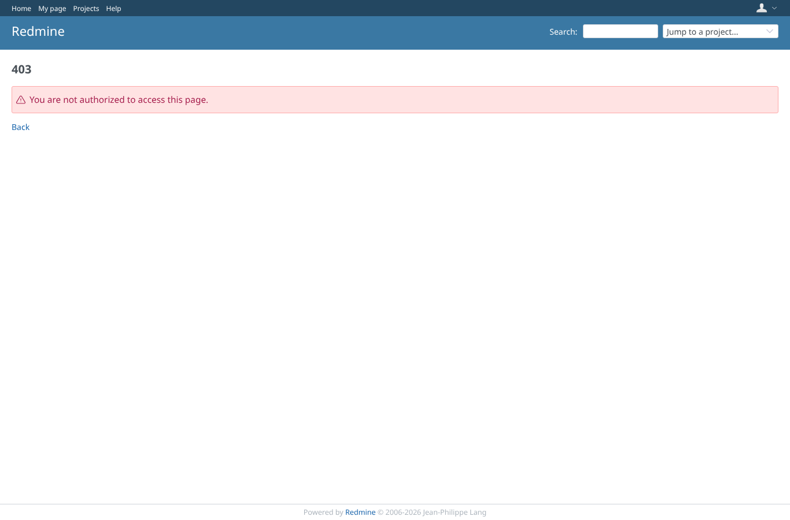

# upgrade_roles

Run 2026-10-08T05:44:04.875Z against http://127.0.0.1:3001.

| screenshot | user | URL | shows |
|---|---|---|---|
|  | admin | `/roles/permissions` | Administration > Roles > Permissions report: which role has view_issue_description |
|  | admin | `/roles/permissions` | manager (all trackers) 200; scoped (first tracker only), reporter, reader (no view_issue_description) and outsider 403 |
|  | manager | `/roles/permissions` | manager is refused the permissions report (administrators only) |
|  | reporter | `/roles/permissions` | reporter is refused the permissions report (administrators only) |
|  | outsider | `/roles/permissions` | outsider is refused the permissions report (administrators only) |
