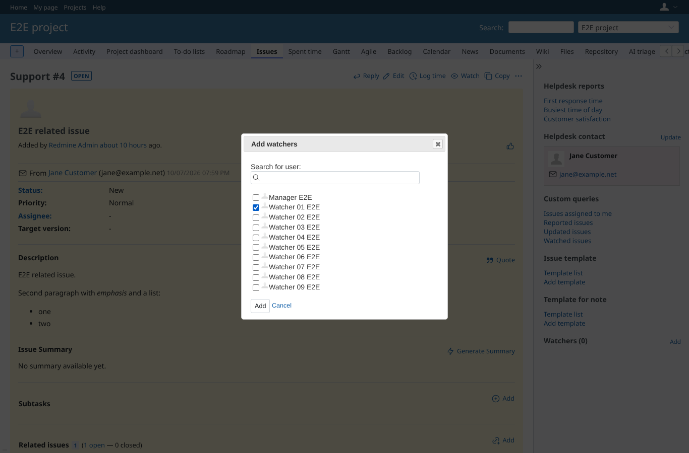
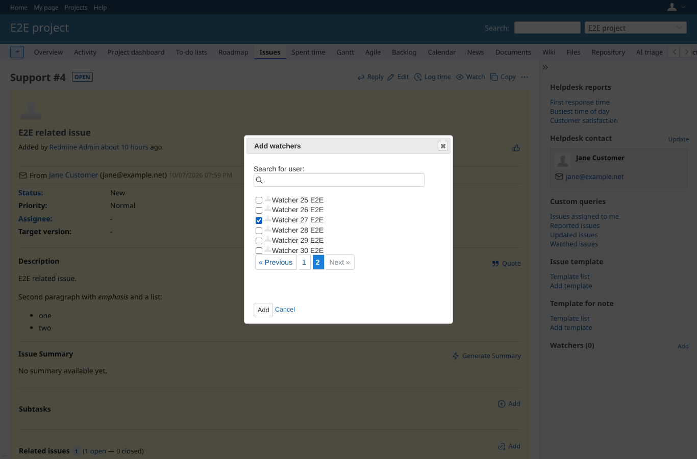
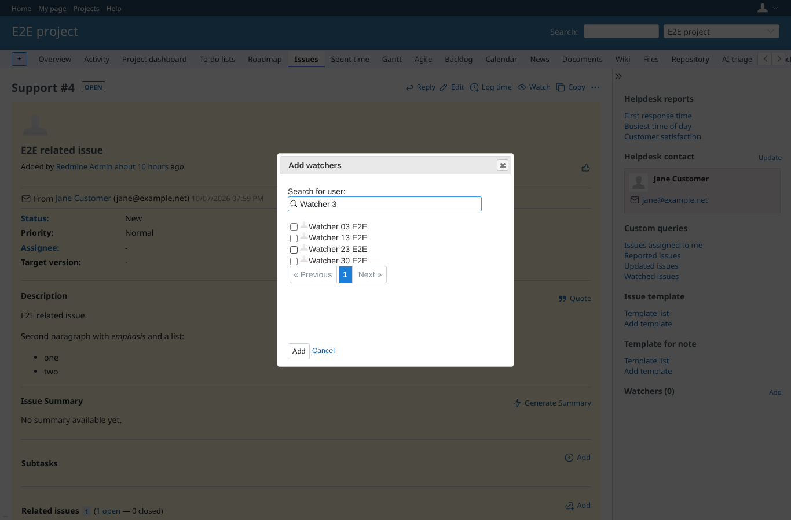
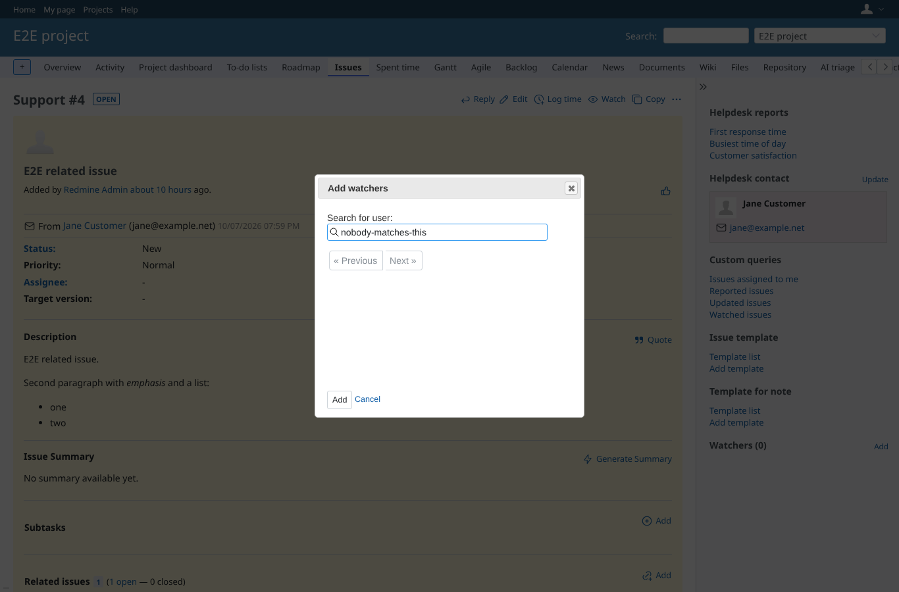
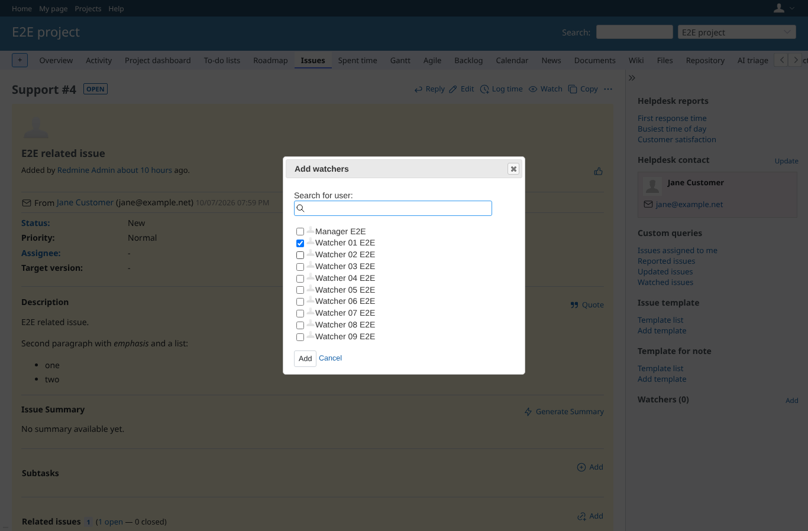
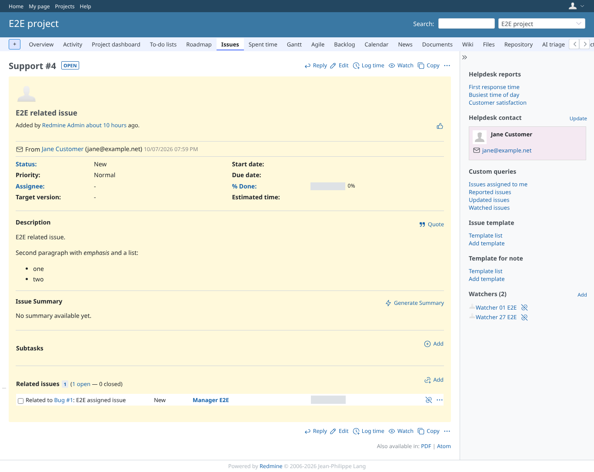

# watchers_modal

Run 2026-10-08T05:46:20.273Z against http://127.0.0.1:3001.

| screenshot | user | URL | shows |
|---|---|---|---|
|  | manager | `/issues/4` | Page 1 of the candidates: only users with view_watched_issues, 25 per page; Watcher 01 checked |
|  | manager | `/issues/4` | Page 2 and back to page 1: Watcher 01 is still checked |
|  | manager | `/issues/4` | Page 2; Watcher 27 checked, Watcher 01 is kept as a hidden field |
|  | manager | `/issues/4` | Searching "Watcher 3" filters the candidates (every word must match: 03, 13, 23, 30) |
|  | manager | `/issues/4` | A search without a match lists no candidates |
|  | manager | `/issues/4` | Search cleared: page 1 again, Watcher 01 still checked |
|  | manager | `/issues/4` | Add: the users checked on page 1 and page 2 are both watchers now |
