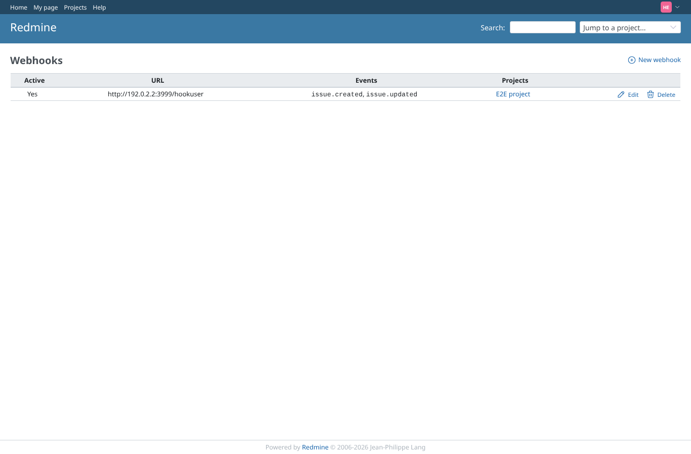
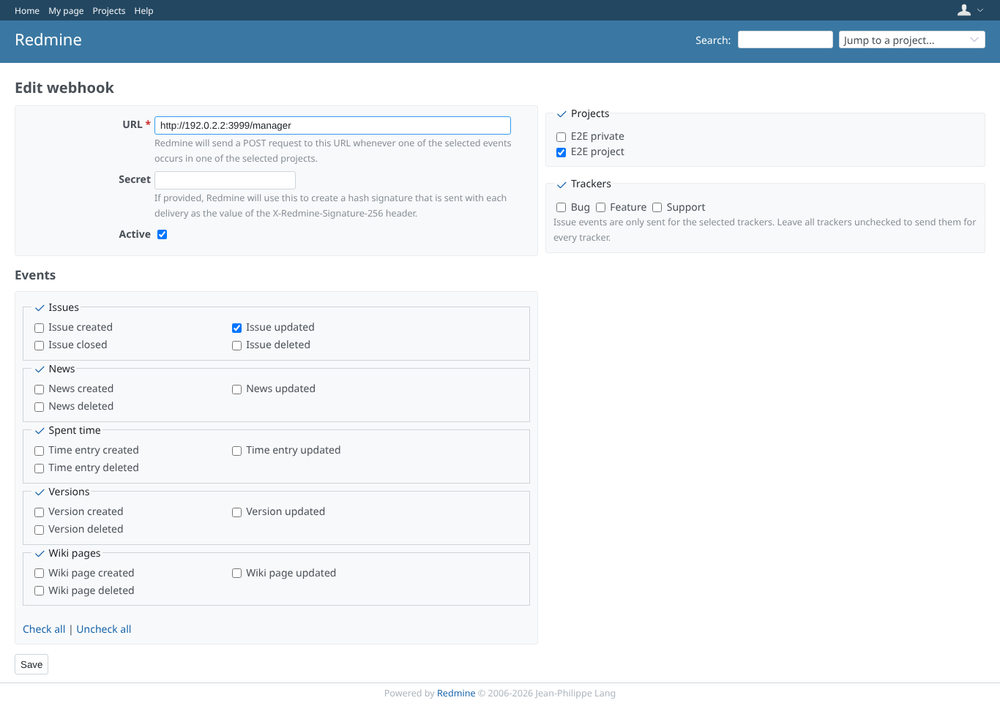
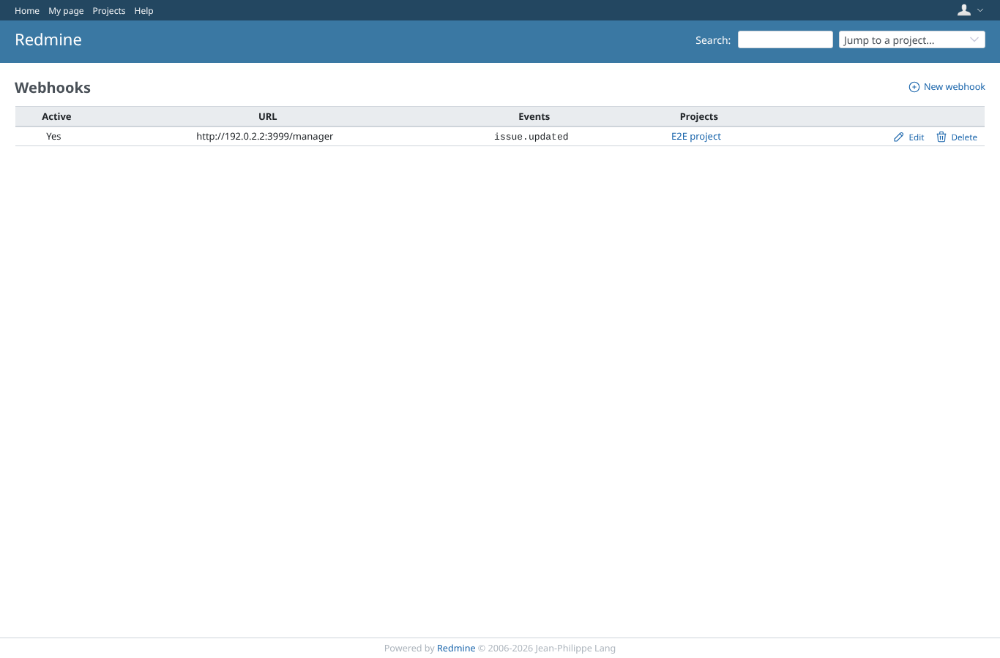
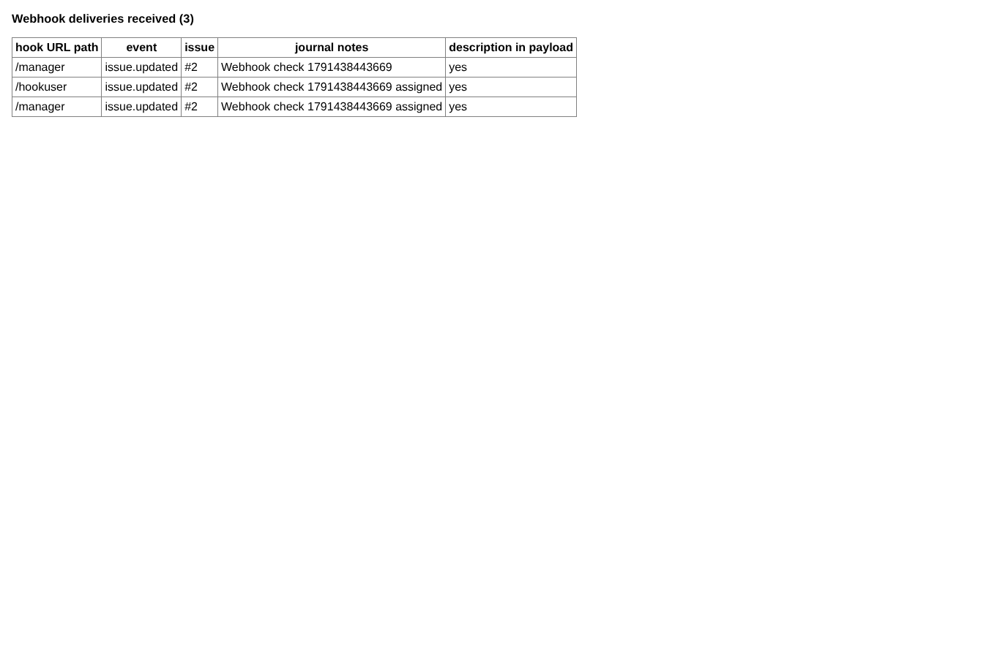

# webhooks

Run 2026-10-08T05:48:00.823Z against http://127.0.0.1:3001.

| screenshot | user | URL | shows |
|---|---|---|---|
|  | hookuser | `/webhooks` | hookuser (use_webhooks, no view_issue_description) owns an active issue hook on the project |
|  | manager | `/webhooks/2/edit` | Manager sets up an active issue.updated hook for the E2E project |
|  | manager | `/webhooks` | The manager hook is listed |
|  | manager | `http://127.0.0.1:3999/` | Receiver: the note reached only the manager hook; after assigning hookuser, its hook got the update too |
